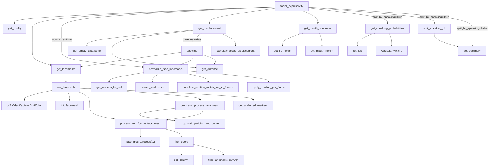
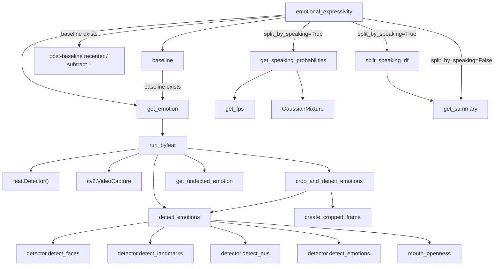
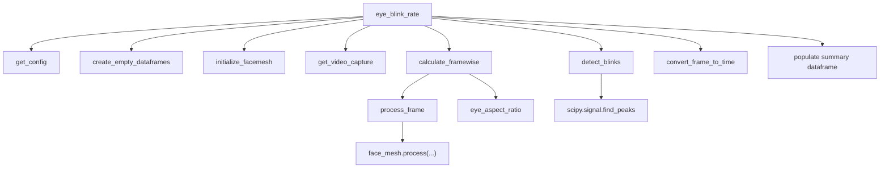
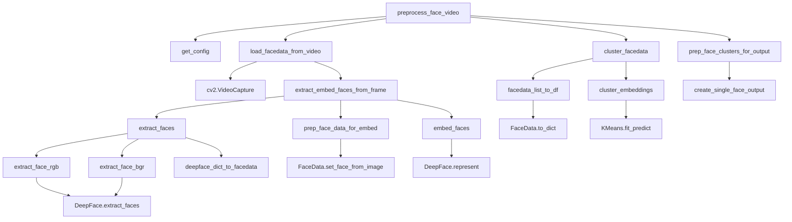
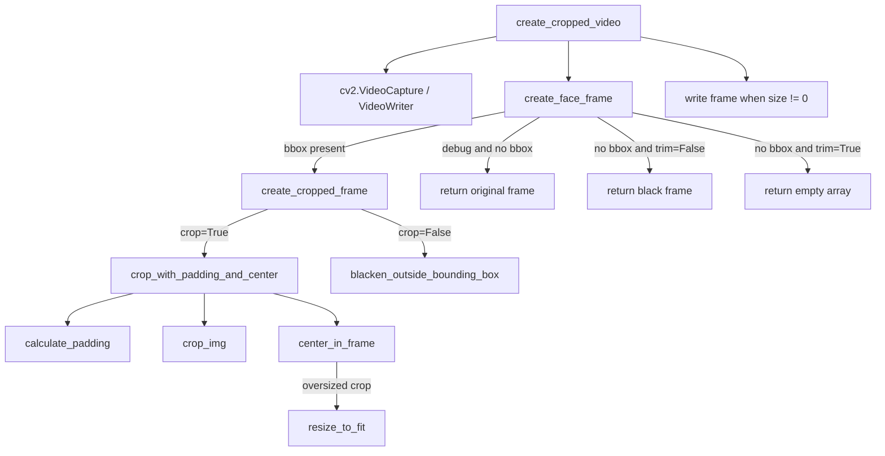

# airest-voice (OpenWillis Face Demo)

This folder contains a local `openwillis-face` package copy and a runnable demo notebook.

## 1) Create environment

`openwillis-face` requires Python `>=3.9,<3.11`.

This setup uses the available Python `3.10.12` interpreter from:

`/Users/pelmeshek1706/Desktop/projects/final_airest_voice/airest/.venv/bin/python`

Run:

```bash
cd /Users/pelmeshek1706/Desktop/projects/airest-voice

/Users/pelmeshek1706/Desktop/projects/final_airest_voice/airest/.venv/bin/python -m venv .venv
source .venv/bin/activate

python -m pip install --upgrade pip setuptools wheel
python -m pip install -r openwillis-face/requirements.txt
python -m pip install -e openwillis-face
```

## 2) Pin compatible Torch stack

`py-feat` inside `openwillis-face` needs a torchvision API that still includes `torchvision.io.read_video`.

Run:

```bash
cd /Users/pelmeshek1706/Desktop/projects/airest-voice
source .venv/bin/activate

python -m pip install --force-reinstall torch==2.2.2 torchvision==0.17.2 numpy==1.23.5
```

## 3) (Optional) Install Jupyter kernel

```bash
cd /Users/pelmeshek1706/Desktop/projects/airest-voice
source .venv/bin/activate

python -m pip install jupyter ipykernel
python -m ipykernel install --user --name airest-voice --display-name "Python (airest-voice)"
```

## 4) Demo notebook

Notebook file:

`/Users/pelmeshek1706/Desktop/projects/airest-voice/demo_openwillis_face.ipynb`

Open it with:

```bash
cd /Users/pelmeshek1706/Desktop/projects/airest-voice
source .venv/bin/activate
jupyter notebook demo_openwillis_face.ipynb
```

## 5) Files used by demo

- `filepath='video.mov'` (already present in this folder)
- `baseline_filepath='/Users/pelmeshek1706/Downloads/baseline (1).mp4'`

If `video.mov` is missing, create it from sample data:

```bash
cp sample_data/expressive.mp4 video.mov
```

## 6) Quick CLI smoke test

```bash
cd /Users/pelmeshek1706/Desktop/projects/airest-voice
source .venv/bin/activate

python - <<'PY'
import openwillis.face as owf

framewise_loc, framewise_disp, summary = owf.facial_expressivity(
    filepath='video.mov',
    baseline_filepath='/Users/pelmeshek1706/Downloads/baseline (1).mp4',
    bbox_list=[],
    base_bbox_list=[],
    frames_per_second=10,
    normalize=True,
    align=False,
    rolling_std_seconds=3,
    split_by_speaking=False,
)

print(framewise_loc.shape, framewise_disp.shape, summary.shape)
PY
```

## 7) Function Dependency Diagrams

The package exports five main entry points from `openwillis.face`:

- `facial_expressivity`
- `emotional_expressivity`
- `eye_blink_rate`
- `preprocess_face_video`
- `create_cropped_video`

### `facial_expressivity`



### `emotional_expressivity`



### `eye_blink_rate`



### `preprocess_face_video`



### `create_cropped_video`



## 8) Additional Documentation

- [Blink rate notes](/Users/pelmeshek1706/Desktop/projects/airest-voice/blink_rate.md)
- [Facial expression / facial expressivity notes](/Users/pelmeshek1706/Desktop/projects/airest-voice/facial_expression.md)
- [Emotional expressivity notes](/Users/pelmeshek1706/Desktop/projects/airest-voice/emotional_expressivity.md)
