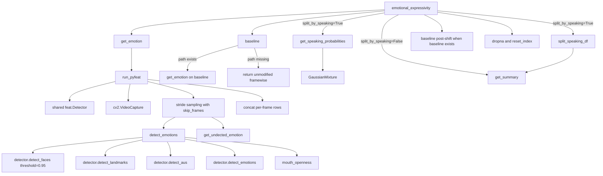

# Emotional Expressivity Feature Inventory

This note documents the concrete local outputs produced by `openwillis.face.emotional_expressivity()`.

It is based on:

- `openwillis-face/src/openwillis/face/facial_emotion.py`
- `openwillis-face/src/openwillis/face/util/speaking_utils.py`
- `facial_expression/facial_expressivity_feature_inventory.md`
- `emotional_expressivity/emotional_expressivity.md`
- `emotional_expressivity/Emotional Expressivity Biomarkers for PTSD, Depression, and Anxiety Detection.pdf`
- `demo_openwillis_face.ipynb`
- local validation on `video.mov` with `sample_data/baseline.mp4`

## Entry point

```python
import openwillis.face as owf

framewise, summary = owf.emotional_expressivity(
    filepath="video.mov",
    baseline_filepath="sample_data/baseline.mp4",
    bbox_list=[],
    base_bbox_list=[],
    skip_frames=5,
    split_by_speaking=False,
    rolling_std_seconds=3,
)
```

Returned objects:

| Object | Granularity | Description |
| --- | --- | --- |
| `framewise` | sampled source frames | Per-frame metadata, emotion scores, AU outputs, `mouth_openness`, optional `speaking_probability`. |
| `summary` | one row per run | Mean/std columns for every feature after metadata, optionally split into speaking and not-speaking summaries. |

## Implementation pipeline



## Sampling contract

`skip_frames` is a stride control.

Effective stride:

```text
skip_frames + 1
```

The first frame is analyzed, then the next `skip_frames` frames are skipped.

Examples:

| `skip_frames` | Analyzed source frames at 30 fps | Approximate sampled rate |
| ---: | --- | ---: |
| `0` | `0, 1, 2, 3, ...` | 30 fps |
| `1` | `0, 2, 4, 6, ...` | 15 fps |
| `2` | `0, 3, 6, 9, ...` | 10 fps |
| `5` | `0, 6, 12, 18, ...` | 5 fps |
| `29` | `0, 30, 60, 90, ...` | 1 fps |

This is not invariant to source-video fps. A 60 fps video with `skip_frames=5` samples about 10 fps, while a 30 fps video with the same value samples about 5 fps.

## Framewise table

### Metadata columns

| Column | Type | Meaning |
| --- | --- | --- |
| `frame` | numeric | Original source-video frame number. |
| `time` | numeric | `frame / source_fps`, in seconds. |

The returned `frame` values are not contiguous when `skip_frames > 0`.

For `skip_frames=5`, the first returned frames should usually be:

```text
0, 6, 12, 18, 24, ...
```

### Emotion columns

Source:

- `feat.utils.FEAT_EMOTION_COLUMNS`

Columns:

| Column | No-baseline interpretation | Baselined interpretation |
| --- | --- | --- |
| `anger` | py-feat anger score multiplied by `100` | Relative-to-baseline anger transform. |
| `disgust` | py-feat disgust score multiplied by `100` | Relative-to-baseline disgust transform. |
| `fear` | py-feat fear score multiplied by `100` | Relative-to-baseline fear transform. |
| `happiness` | py-feat happiness score multiplied by `100` | Relative-to-baseline happiness transform. |
| `sadness` | py-feat sadness score multiplied by `100` | Relative-to-baseline sadness transform. |
| `surprise` | py-feat surprise score multiplied by `100` | Relative-to-baseline surprise transform. |
| `neutral` | py-feat neutral score multiplied by `100` | Relative-to-baseline neutral transform. |

### Action unit columns

Source:

- `feat.pretrained.AU_LANDMARK_MAP["Feat"]`

Columns:

| Column | Common FACS shorthand | Local output note |
| --- | --- | --- |
| `AU01` | Inner brow raiser | py-feat AU output; baseline mode transforms scale. |
| `AU02` | Outer brow raiser | py-feat AU output; baseline mode transforms scale. |
| `AU04` | Brow lowerer | py-feat AU output; baseline mode transforms scale. |
| `AU05` | Upper lid raiser | py-feat AU output; baseline mode transforms scale. |
| `AU06` | Cheek raiser | py-feat AU output; baseline mode transforms scale. |
| `AU07` | Lid tightener | py-feat AU output; baseline mode transforms scale. |
| `AU09` | Nose wrinkler | py-feat AU output; baseline mode transforms scale. |
| `AU10` | Upper lip raiser | py-feat AU output; baseline mode transforms scale. |
| `AU11` | Nasolabial deepener | py-feat AU output; baseline mode transforms scale. |
| `AU12` | Lip corner puller | py-feat AU output; baseline mode transforms scale. |
| `AU14` | Dimpler | py-feat AU output; baseline mode transforms scale. |
| `AU15` | Lip corner depressor | py-feat AU output; baseline mode transforms scale. |
| `AU17` | Chin raiser | py-feat AU output; baseline mode transforms scale. |
| `AU20` | Lip stretcher | py-feat AU output; baseline mode transforms scale. |
| `AU23` | Lip tightener | py-feat AU output; baseline mode transforms scale. |
| `AU24` | Lip pressor | py-feat AU output; baseline mode transforms scale. |
| `AU25` | Lips part | py-feat AU output; baseline mode transforms scale. |
| `AU26` | Jaw drop | py-feat AU output; baseline mode transforms scale. |
| `AU28` | Lip suck | py-feat AU output; baseline mode transforms scale. |
| `AU43` | Eyes closed | py-feat AU output; baseline mode transforms scale. |

The FACS shorthand is included for interpretability. The local dataframe itself only exposes the AU IDs.

### Mouth openness column

| Column | Definition | Notes |
| --- | --- | --- |
| `mouth_openness` | Mean 2D distance between py-feat upper lip landmarks `[61, 62, 63]` and lower lip landmarks `[65, 66, 67]`. | Different from `facial_expressivity` mouth-openness ratio. Used by speaking split. |

### Optional speaking column

| Column | Definition | Notes |
| --- | --- | --- |
| `speaking_probability` | Probability from a 2-component GMM over rolling std of `mouth_openness`. | A visual proxy, not audio VAD. Dropped from summary features after splitting. |

## Summary table

`get_summary(df, 2)` computes:

- `df.mean()` for all columns after `frame` and `time`
- `df.std()` for all columns after `frame` and `time`
- suffixes `_mean` and `_std`
- one output row

### No speaking split

Expected summary families:

| Family | Count | Columns |
| --- | ---: | --- |
| Mouth | 2 | `mouth_openness_mean`, `mouth_openness_std` |
| Emotions | 14 | 7 emotion means and 7 emotion stds |
| AUs | 40 | 20 AU means and 20 AU stds |
| Total | 56 | 28 features x 2 statistics |

### With speaking split

`split_speaking_df()` creates two dataframes:

- speaking rows where `speaking_probability > 0.5`
- not-speaking rows where `speaking_probability <= 0.5`

It then computes `get_summary()` on both and adds suffixes:

- `_speaking`
- `_not_speaking`

Expected output:

| Family | Count |
| --- | ---: |
| Mouth split summaries | 4 |
| Emotion split summaries | 28 |
| AU split summaries | 80 |
| Total | 112 |

This assumes both split groups contain data.

## Baseline transform

Baseline mode applies only when `baseline_filepath` exists.

Emotion/AU columns use:

```text
((main_value + 1) / (baseline_mean + 1)) - 1
```

But the local implementation computes the summary before the final `-1` shift. So:

- returned framewise emotion/AU columns are approximately ratio-minus-one
- summary emotion/AU columns are ratio values before subtracting one

`mouth_openness` is not included in the baseline ratio step, but it is affected by the final global subtract-one step in returned framewise output.

Practical implication:

- no-baseline output is best for simple model-score inspection
- baseline output is best treated as an experimental within-person relative signal
- do not combine no-baseline and baselined runs without adding a mode flag

## Validated local run

Inputs:

- `filepath="video.mov"`
- `baseline_filepath="sample_data/baseline.mp4"`
- `skip_frames=5`
- `split_by_speaking=False`

Observed shapes:

| Object | Shape |
| --- | --- |
| `framewise` | `(108, 30)` |
| `summary` | `(1, 56)` |

Observed framewise column families:

| Family | Count |
| --- | ---: |
| Metadata | 2 |
| Mouth | 1 |
| Emotions | 7 |
| AUs | 20 |
| Total | 30 |

Observed summary highlights from the baselined run:

| Metric | Value |
| --- | ---: |
| `surprise_mean` | `24.191500` |
| `anger_mean` | `7.465008` |
| `happiness_mean` | `4.830577` |
| `fear_mean` | `3.815408` |
| `disgust_mean` | `1.101504` |
| `sadness_mean` | `0.820626` |
| `neutral_mean` | `0.307490` |
| `AU25_mean` | `1.682072` |
| `AU20_mean` | `1.527778` |
| `AU26_mean` | `1.325430` |
| `AU10_mean` | `1.311244` |
| `AU12_mean` | `1.217659` |
| `AU14_mean` | `1.188605` |
| `AU06_mean` | `1.115396` |
| `AU28_mean` | `0.977249` |

Interpretation caveat:

- these are baselined summary values from the current implementation
- they are useful for relative pattern inspection
- they should not be presented as raw probabilities

## Model stack

The local implementation creates:

```python
feat.Detector()
```

with default py-feat arguments.

The adjacent `facial_expression` inventory records the installed runtime defaults as:

| Component | Default model |
| --- | --- |
| Face detection | `retinaface` |
| Landmarks | `mobilefacenet` |
| AUs | `xgb` |
| Emotions | `resmasknet` |
| Face pose | `img2pose` |
| Identity | `facenet` |

For reproducible research output, persist exact package versions and model names at run time rather than assuming these defaults never change.

## Research-backed feature roadmap

The local PDF `Emotional Expressivity Biomarkers for PTSD, Depression, and Anxiety Detection.pdf` argues that the most defensible emotional-expressivity biomarkers are not coarse emotion labels alone. The stronger pattern across depression, PTSD, and anxiety studies is:

- AUs are the strongest common denominator across depression and PTSD work.
- Head pose and gaze materially improve anxiety-related and depression-related modeling.
- Temporal dynamics are often clinically meaningful but underrepresented in the current output.
- Speech-linked mouth movement is a major confound and should be separated with audio VAD when possible.
- Context matters, especially for PTSD and trauma-related interviews.
- QC and uncertainty metadata are required before clinical or research interpretation.

### Disorder-specific feature emphasis

| Disorder / state | Most relevant feature families from the PDF | Current local coverage |
| --- | --- | --- |
| Depression | Reduced positive expressivity, mouth-corner/smile change, brow activity, AU intensity, head movement, temporal variability and entropy. | Partially covered through emotions/AUs and `mouth_openness`; missing head pose and richer dynamics. |
| PTSD | Context-sensitive visual arousal, AU sequences, landmarks, gaze, head pose, speech prosody, language content. | Partially covered through AUs/emotions; missing context labels, gaze/head pose, and multimodal fusion. |
| Anxiety / anxious states | Anger/fear/neutral differences, head rotation, jawline/eye-region movement, gaze cues, tension/arousal dynamics. | Partially covered through anger/fear/neutral and AUs; missing head/eye/gaze families. |

### Evidence highlights from the PDF

| Study | Key quantitative or methodological takeaway |
| --- | --- |
| Alghowinem et al., 2013 | Depression head-pose/movement features reached `71.2%` average recognition. |
| Jiang et al., 2021 | Longitudinal depression interviews produced AUC `0.72` for remission and `0.75` for treatment response using emotions, AUs, and temporal statistics. |
| Mahayossanunt et al., 2023 | Depression interview model reported accuracy `91.67%` and F1 `88.89%` from gaze, AU, and expression features. |
| Jin et al., 2025 | E-DAIC video-only F1 `0.853`, AUC `0.912`; multimodal F1 `0.922`, AUC `0.950`; feature contribution ranked AU > pose > audio > gaze. |
| Schultebraucks et al., 2022 | Trauma-survivor multimodal classifier reported PTSD AUC `0.90`, weighted F1 `0.83`; depression AUC `0.86`, weighted F1 `0.82`. |
| Aathreya et al., 2025 | Child-PTSD baseline found AU intensities to be the optimal feature family, with classification depending on conversational context. |
| Ren et al., 2025 | GAD screening showed AUC `0.792` for anger, `0.727` for fear, and `0.723` for neutral. |
| AnxietyFaceTrack, 2025 preprint | Social-state anxiety model reached multiclass accuracy `0.91`, F1 `0.90`, AUC `0.98`; head rotation and eye/jawline features were important. |

### Recommended additions mapped to this inventory

| Feature group | Concrete variables | Current status | Priority |
| --- | --- | --- | --- |
| Core AUs | AU01, AU02, AU04, AU05, AU06, AU07, AU10, AU12, AU14, AU15, AU17, AU20, AU23, AU24, AU25, AU26, eye closure; intensity and presence | Mostly present as py-feat AU columns, but presence/episode summaries are missing. Local py-feat emits `AU43` for eye closure; the PDF's roadmap names `AU45`. | Very high |
| Valence/arousal proxies | Positive-AU composite, negative-AU composite, neutral proportion, anger/fear/sadness intensity | Not explicitly computed. | Very high |
| Mouth and speech separation | Mouth openness, lip compression, smile amplitude, speaking probability, non-speaking expressivity | `mouth_openness` and mouth-proxy speaking split exist; audio VAD and active-speaker logic are missing. | Very high |
| Head dynamics | Yaw, pitch, roll mean/std/range/velocity; nod and shake episode counts | Missing from `emotional_expressivity`. | High |
| Gaze and eyes | Horizontal/vertical gaze, fixation stability, gaze aversion proportion, blink count, blink duration | Missing from this function; blink is documented separately in `blink_rate/`. | High |
| Temporal dynamics | Windowed mean/std, coefficient of variation, sample entropy, spectral entropy, autocorrelation, burstiness, transition counts | Only mean/std summaries exist. | Very high |
| Symmetry and laterality | Left-right AU asymmetry, unilateral smile/brow activity, head-turn bias | Missing. | Medium |
| Quality and confounds | Detection confidence, missingness ratio, occlusion ratio, illumination flag, speaking ratio | Missing as structured public output. | Very high |

### Recommended windowing and evaluation contract

The PDF recommends a research pipeline with:

- native-frame feature extraction before downsampling
- resampling to about `10` fps after extraction
- `2-10` second windows with `50%` overlap
- both window summaries and raw sequences
- interpretable baselines such as elastic net or XGBoost
- sequence models such as BiLSTM or small transformers
- multimodal fusion across face, audio, and text

Evaluation should report:

- subject-exclusive splits
- nested cross-validation
- AUC, F1, balanced accuracy, sensitivity, and specificity
- calibration metrics such as Brier score or ECE
- bootstrapped confidence intervals
- subgroup performance by sex, age, and site
- exact target definition, such as diagnosis, severity score, or state self-report

## Missingness and quality fields

The current public return values do not include explicit QC fields.

Missingness is implicit:

- skipped frames are not returned
- failed sampled frames are usually dropped by `dropna()`
- exceptions are logged, not returned as structured metadata

Recommended QC metadata for future output:

| Field | Meaning |
| --- | --- |
| `source_frame_count` | Total frames reported by OpenCV. |
| `source_fps` | FPS reported by OpenCV. |
| `skip_frames` | Sampling stride parameter. |
| `expected_sampled_frames` | Expected sampled-frame count from source frame count and stride. |
| `successful_sampled_frames` | Rows returned after detection and `dropna()`. |
| `failed_sampled_frames` | Sampled frames replaced by `NaN` and dropped. |
| `dropped_rows` | Internal rows removed before public return. |
| `baseline_requested` | Whether caller passed a nonempty baseline path. |
| `baseline_used` | Whether that baseline path existed and was processed. |
| `bbox_used` | Whether external bboxes were supplied. |
| `model_stack` | py-feat detector component names and versions. |

## Known implementation mismatches

| Area | Current behavior | Risk |
| --- | --- | --- |
| Sampling | `skip_frames` stride, not target fps | Timing expectations can be wrong. |
| Missing baseline | silently falls back to raw mode | Output can be mislabeled as baselined. |
| Baseline summary | summary computed before final framewise shift | Summary and framewise scales differ. |
| Mouth baseline | excluded from ratio but shifted by `-1` | Returned mouth openness is distorted in baseline mode. |
| Overall expressivity | docstring mentions it, code does not compute it | Downstream schema assumptions can be wrong. |
| Bbox helper | `bb_y + bb_y` used instead of likely `bb_y + bb_h` | Cropping helpers can produce bad boxes if used. |
| Error handling | broad exceptions return logged failures | Callers lack structured failure reasons. |
| QC | no detection-quality return table | Hard to distinguish low signal from failed processing. |

## Recommended schema if promoted to AIREST output

Framewise artifact:

- `features/emotional_expressivity_framewise.csv`

Required columns:

- `session_id`
- `task_id`
- `frame_idx`
- `timestamp_sec`
- `emotion_anger`
- `emotion_disgust`
- `emotion_fear`
- `emotion_happiness`
- `emotion_sadness`
- `emotion_surprise`
- `emotion_neutral`
- `au01`
- `au02`
- `au04`
- `au05`
- `au06`
- `au07`
- `au09`
- `au10`
- `au11`
- `au12`
- `au14`
- `au15`
- `au17`
- `au20`
- `au23`
- `au24`
- `au25`
- `au26`
- `au28`
- `au43`
- `mouth_openness`
- optional `speaking_probability`
- `baseline_mode`
- `model_version`

Summary artifact:

- `features/emotional_expressivity_summary.csv`

Recommended columns:

- one row per session/task
- mean/std for every emotion
- mean/std for every AU
- mean/std for `mouth_openness`
- optional speaking/not-speaking variants
- `n_source_frames`
- `n_expected_sampled_frames`
- `n_successful_sampled_frames`
- `baseline_mode`
- `baseline_artifact_id`
- `processing_status`

Metadata artifact:

- `features/emotional_expressivity_meta.json`

Recommended content:

- input video path/hash
- baseline video path/hash
- package versions
- py-feat model components
- `skip_frames`
- bbox source
- runtime
- warnings
- error messages

## Source files

- `openwillis-face/src/openwillis/face/facial_emotion.py`
- `openwillis-face/src/openwillis/face/util/speaking_utils.py`
- `openwillis-face/src/openwillis/face/util/crop_utils.py`
- `openwillis-face/src/openwillis/face/config/facial.json`
- `demo_openwillis_face.ipynb`
- `README.md`
- `emotional_expressivity/Emotional Expressivity Biomarkers for PTSD, Depression, and Anxiety Detection.pdf`
