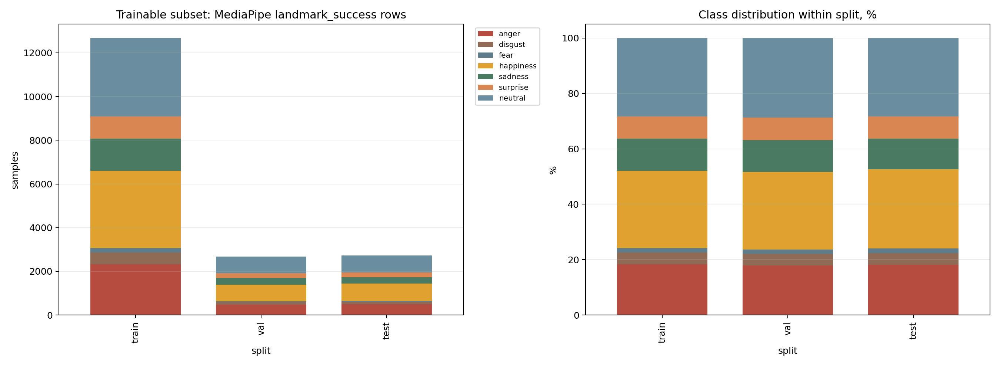
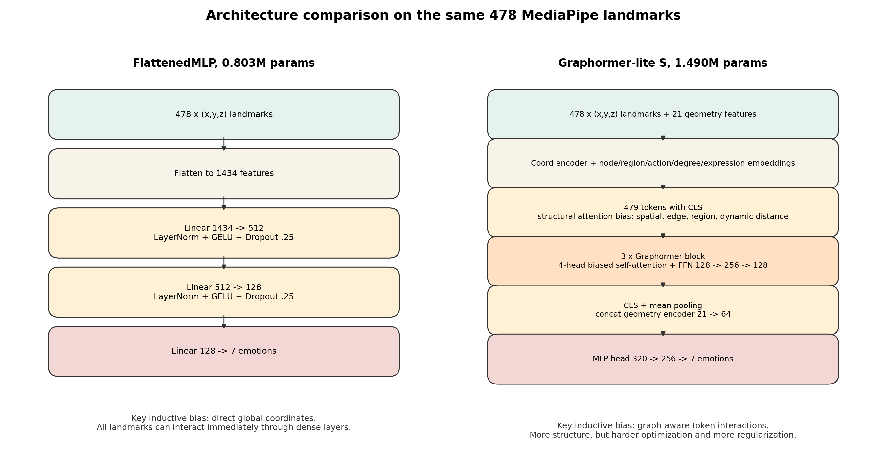
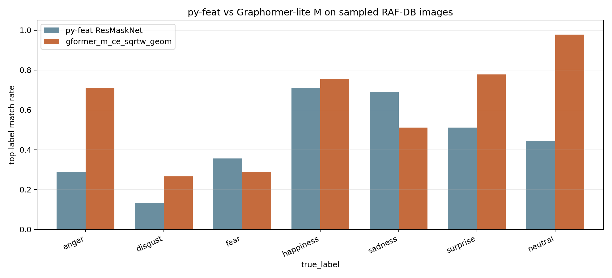
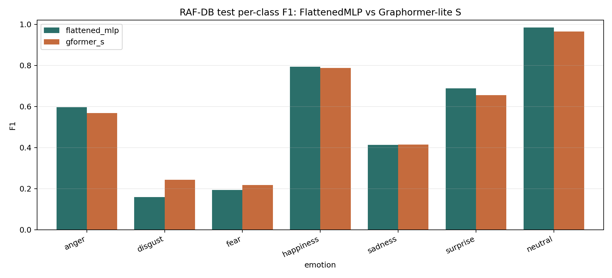

# Model Training Report: RAF-DB Landmark Graphormer-Lite

Report date: 2026-05-25  
Project: `airest-face` / `openwillis-face` emotional expressivity  
Primary goal: evaluate whether a lightweight landmark-only model can replace or complement `py-feat` emotion inference in the local pipeline while preserving the same 7 basic emotion outputs and reducing dependency on the heavier image-based stack.

## 1. Executive Summary

| Finding | Details |
| --- | --- |
| Best current model | `gformer_m_ce_sqrtw_geom_seed42` |
| Main held-out RAF-DB test result | accuracy `0.7397`, macro-F1 `0.5817`, balanced accuracy `0.5832` |
| Small Graphormer-lite model | `gformer_s_ce_sqrtw_geom_seed42`: accuracy `0.7165`, macro-F1 `0.5501` |
| Strong legacy baseline | `flattened_mlp`: accuracy `0.7140`, macro-F1 `0.5470`, balanced accuracy `0.5667` |
| Comparison with `py-feat` | On the current RAF-DB sample artifact, `n=315`: top-label match with dataset labels is `0.4476` for `py-feat` and `0.6127` for `gformer_m` |
| Main practical conclusion | `gformer_m` is already more aligned with RAF-DB labels than `py-feat`, but `py-feat` is not an oracle: it is a different model trained on a different image-level dataset and a different preprocessing pipeline. |

Recommendation: use `gformer_m_ce_sqrtw_geom_seed42` as the main RAF-DB landmark baseline. Keep `gformer_s` as the lightweight option. Always keep `flattened_mlp` as a control baseline, because a simple dense model is unexpectedly strong on normalized MediaPipe landmarks.

## 2. Source Artifacts

| Artifact | Path |
| --- | --- |
| Graphormer-lite training notebook | `output/jupyter-notebook/emotional_expressivity/rafdb_graphormer_lite_full_colab_uv_mediapipe_legacy_exp.ipynb` |
| Graphormer-lite run outputs | `output/jupyter-notebook/emotional_expressivity/rafdb_graphormer_lite_full_run_exp/` |
| Best medium model summary | `output/jupyter-notebook/emotional_expressivity/rafdb_graphormer_lite_full_run_exp/experiments/20260525_140301_gformer_m_ce_sqrtw_geom_seed42/summary.json` |
| Best small model summary | `output/jupyter-notebook/emotional_expressivity/rafdb_graphormer_lite_full_run_exp/experiments/20260525_131238_gformer_s_ce_sqrtw_geom_seed42/summary.json` |
| Legacy baseline results | `output/jupyter-notebook/emotional_expressivity/rafdb_precomputed_landmark_graph_run/results/comparison.csv` |
| py-feat comparison notebook | `output/jupyter-notebook/emotional_expressivity/mediapipe_pyfeat_test.ipynb` |
| py-feat comparison results | `output/jupyter-notebook/emotional_expressivity/mediapipe_pyfeat_test/results/` |
| RAF-DB MediaPipe cache | `output/jupyter-notebook/emotional_expressivity/rafdb_mediapipe_768_publish/cache/processed_rows_full.jsonl` |

## 3. Dataset

### 3.1 Training Dataset

Dataset used: `Pelmeshek/raf-db-7emotions-mediapipe-768`.

This is a RAF-DB-derived dataset with 7 emotion labels:

`anger`, `disgust`, `fear`, `happiness`, `sadness`, `surprise`, `neutral`.

Graphormer-lite was trained not on raw images, but on rows where MediaPipe FaceMesh successfully produced landmarks:

- `478` MediaPipe landmarks per face.
- Each point has `(x, y, z)` coordinates.
- Main column: `landmarks_stable_eye_norm`.
- Landmark coordinates are normalized in a stable eye-based coordinate system.
- An additional `21` engineered geometry features are computed.

### 3.2 Raw Split Distribution

These are all rows in the local RAF-DB MediaPipe cache before applying the `landmark_success` filter.

| split | anger | disgust | fear | happiness | sadness | surprise | neutral | total |
| --- | ---: | ---: | ---: | ---: | ---: | ---: | ---: | ---: |
| train | 2850 | 614 | 248 | 4170 | 1722 | 1133 | 3592 | 14329 |
| val | 610 | 132 | 53 | 894 | 369 | 243 | 770 | 3071 |
| test | 611 | 131 | 54 | 893 | 369 | 243 | 770 | 3071 |
| total | 4071 | 877 | 355 | 5957 | 2460 | 1619 | 5132 | 20471 |

### 3.3 Trainable Subset After MediaPipe Filtering

This is the actual subset used for training, validation, and testing.

| split | anger | disgust | fear | happiness | sadness | surprise | neutral | total |
| --- | ---: | ---: | ---: | ---: | ---: | ---: | ---: | ---: |
| train | 2327 | 532 | 203 | 3545 | 1468 | 1013 | 3591 | 12679 |
| val | 479 | 112 | 41 | 753 | 307 | 217 | 770 | 2679 |
| test | 495 | 112 | 45 | 780 | 299 | 219 | 770 | 2720 |
| total | 3301 | 756 | 289 | 5078 | 2074 | 1449 | 5131 | 18078 |

Coverage:

| split | raw total | landmark_success total | coverage |
| --- | ---: | ---: | ---: |
| train | 14329 | 12679 | 0.8848 |
| val | 3071 | 2679 | 0.8724 |
| test | 3071 | 2720 | 0.8857 |
| total | 20471 | 18078 | 0.8831 |

All failures in the current cache have the reason `no_face_detected`.



### 3.4 Important Consequence Of Filtering

MediaPipe filtering is not class-neutral.

Example:

- Raw train `neutral` = `3592`, after filtering `3591`.
- Raw train `happiness` = `4170`, after filtering `3545`.
- Raw train `anger` = `2850`, after filtering `2327`.

In other words, `neutral` is almost never lost, while non-neutral classes lose a noticeable share of samples. This increases imbalance in the trainable subset and explains why class weights and macro-F1 are required as core training and selection tools.

### 3.5 MediaPipe Thresholds And Failure Analysis

MediaPipe failures in this dataset are not caused by a custom high threshold. The preprocessing notebook used MediaPipe Tasks `FaceLandmarker` with default confidence thresholds.

Preprocessing notebook:

`output/jupyter-notebook/emotional_expressivity/rafdb-hf-mediapipe-768-publish.ipynb`

Relevant configuration:

```python
options = FaceLandmarkerOptions(
    base_options=BaseOptions(model_asset_path=str(model_path)),
    running_mode=VisionRunningMode.IMAGE,
    num_faces=1,
    output_face_blendshapes=False,
    output_facial_transformation_matrixes=True,
)
```

Because the confidence thresholds were not explicitly set, MediaPipe used its defaults:

| MediaPipe option | value |
| --- | ---: |
| `min_face_detection_confidence` | 0.5 |
| `min_face_presence_confidence` | 0.5 |
| `min_tracking_confidence` | 0.5 |
| `num_faces` | 1 |

The failure condition was:

```python
result = landmarker.detect(mp_image)
if not result.face_landmarks:
    raise RuntimeError("no_face_detected")
```

So a row was marked as failed only when MediaPipe returned no face landmarks at all. This is separate from the `py-feat` comparison notebook, where `py-feat` face detection used `threshold=0.95` with a fallback to `0.5`. That `py-feat` threshold was not used when generating the RAF-DB MediaPipe cache.

Failure rate by class:

| class | initial | failed | failure rate | success | success rate |
| --- | ---: | ---: | ---: | ---: | ---: |
| anger | 4071 | 770 | 18.91% | 3301 | 81.09% |
| disgust | 877 | 121 | 13.80% | 756 | 86.20% |
| fear | 355 | 66 | 18.59% | 289 | 81.41% |
| happiness | 5957 | 879 | 14.76% | 5078 | 85.24% |
| sadness | 2460 | 386 | 15.69% | 2074 | 84.31% |
| surprise | 1619 | 170 | 10.50% | 1449 | 89.50% |
| neutral | 5132 | 1 | 0.02% | 5131 | 99.98% |

Example failed MediaPipe samples:


Observed failure patterns:

- strong profile view;
- partially cropped faces;
- hands, hair, glasses, or objects occluding facial landmarks;
- extreme facial expressions;
- low resolution or strong blur;
- grayscale or low-contrast images;
- dark lighting;
- faces close to the crop boundary.

The most important bias is that `neutral` almost always passes MediaPipe, while non-neutral classes contain more wild or difficult images. This is why `neutral` increases from `25.07%` before filtering to `28.38%` after filtering.

Possible follow-up experiment: rerun MediaPipe extraction with lower thresholds such as `min_face_detection_confidence=0.3` and `min_face_presence_confidence=0.3`, then compare both landmark coverage and downstream model quality against the current `0.5` default. This may recover more samples, but it can also introduce noisy landmarks.

## 4. Why RAF-DB Instead Of The py-feat Dataset

### 4.1 What py-feat Uses

Local `py-feat` version:

- package version: `feat==0.6.2`
- default detector signature: `Detector(face_model='retinaface', landmark_model='mobilefacenet', au_model='xgb', emotion_model='resmasknet', facepose_model='img2pose')`
- emotion model: `resmasknet`
- local config: `feat/resources/ResMaskNet_fer2013_config.json`
- config field: `"data_path": "saved/data/fer2013"`
- emotion labels in ResMaskNet: `angry`, `disgust`, `fear`, `happy`, `sad`, `surprise`, `neutral`

Conclusion: in the installed `py-feat` package, the default emotion detector is an image-based FER2013-style ResMaskNet model, not a MediaPipe-landmark model.

### 4.2 Why We Do Not Train On The FER2013-style Dataset Used By py-feat

| Reason | Explanation |
| --- | --- |
| The target representation is different | Our model consumes `478 x 3` MediaPipe landmarks plus geometry, not cropped face pixels. |
| A stable landmark cache is required | The RAF-DB cache in this project has already been processed with MediaPipe and includes split metadata, failures, normalized landmarks, and reproducible artifacts. |
| The FER2013-style setup does not match the inference target | `py-feat` ResMaskNet works on images through a face detector/crop pipeline. Graphormer-lite is intended to work on landmarks that already exist in the OpenWillis-like pipeline. |
| Reproducibility control | For RAF-DB we have local `config.json`, `history.csv`, `summary.json`, `best_model.pt`, predictions, and confusion matrices. For the pretrained `py-feat` model, the training protocol and source weights are an external black box. |
| Landmark quality | A landmark-only model needs a dataset where landmark extraction is reliable on the target images. The RAF-DB cache explicitly exposes coverage and allows failure filtering. |
| Comparable labels | RAF-DB provides the same 7 basic emotions, so comparison with `py-feat` is possible without changing the task definition. |

RAF-DB is not a clinical dataset. It was selected not because it is better for PTSD, depression, or anxiety, but because it is a practical supervised dataset for training an emotion recognition backbone on the same representation that we want to use downstream.

## 5. Training Setup

### 5.1 Graphormer-lite Runs

Common settings:

| Parameter | Value |
| --- | --- |
| optimizer | `AdamW` |
| base learning rate | `3e-4` |
| weight decay | `0.01` |
| loss | `CrossEntropyLoss` or focal variant |
| label smoothing | `0.05` |
| class weights | inverse class frequency with `power=0.5` |
| scheduler | cosine schedule with 5 warmup epochs |
| max epochs | `80` |
| early stopping | validation macro-F1, patience `15` |
| batch size | `64` |
| gradient clipping | `max_grad_norm=1.0` |
| augmentation | coord noise, z noise, scale jitter, rotation jitter, landmark dropout, region dropout |

Why macro-F1 is used as the selection metric:

- Accuracy is dominated by `happiness` and `neutral`.
- `fear` and `disgust` have very small support.
- For an emotion backbone, it is important not only to classify majority classes well, but also to avoid completely failing rare classes.

### 5.2 Legacy FlattenedMLP Setup

The legacy MLP was trained in the old notebook on the same landmark task, but with a simpler setup:

| Parameter | Value |
| --- | --- |
| optimizer | `AdamW` |
| learning rate | `3e-4` |
| weight decay | `0.01` |
| scheduler | `ReduceLROnPlateau`, factor `0.5`, patience `4` |
| label smoothing | `0.05` |
| class weights | full inverse frequency normalized to mean |
| max epochs | `80` |
| early stopping | validation macro-F1, patience `12` |
| batch size | `128` |

## 6. Architecture Overview

### 6.1 FlattenedMLP

Input:

`478 landmarks x 3 coordinates = 1434 scalar features`

Architecture:

```text
478 x (x,y,z)
    -> flatten to 1434
    -> Linear 1434 -> 512
    -> LayerNorm + GELU + Dropout(0.25)
    -> Linear 512 -> 128
    -> LayerNorm + GELU + Dropout(0.25)
    -> Linear 128 -> 7 emotions
```

Parameter count: `802,567`.

Main characteristic: the first dense layer immediately mixes all landmarks together. This is a strong baseline for normalized facial landmarks, because landmark indices already have fixed anatomical meaning.

### 6.2 Graphormer-lite S

Config:

| Parameter | Value |
| --- | --- |
| params | `1,489,978` |
| `d_model` | `128` |
| layers | `3` |
| heads | `4` |
| FFN | `128 -> 256 -> 128` |
| pooling | `cls_mean` |
| geometry | enabled, `21 -> 64` |
| head | `320 -> 256 -> 7` |

Architecture:

```text
478 x (x,y,z) landmarks
    -> coordinate encoder
    -> + node embedding
    -> + anatomical region embedding
    -> + action-region embedding
    -> + degree embedding
    -> + expression-node embedding
    -> prepend CLS token
    -> structural attention bias:
       spatial shortest-path bucket
       edge type bucket
       same/symmetric/other region relation
       dynamic Euclidean distance bucket
    -> 3 Graphormer blocks
    -> CLS + mean pooling
    -> concat geometry encoder
    -> MLP head
    -> 7 emotions
```

### 6.3 Graphormer-lite M

Config:

| Parameter | Value |
| --- | --- |
| params | `2,900,030` |
| `d_model` | `192` |
| layers | `4` |
| heads | `6` |
| FFN | `192 -> 384 -> 192` |
| pooling | `cls_mean` |
| geometry | enabled, `21 -> 96` |
| head | `480 -> 384 -> 7` |

Difference from `gformer_s`: larger hidden width, more layers, more heads, wider geometry branch, and wider classifier head. The medium size produced a meaningful improvement over `gformer_s`; the focal loss variant, in contrast, degraded the result.

### 6.4 Visual Architecture Comparison



## 7. Model Results On RAF-DB Test

### 7.1 Graphormer-lite Sweep

| model | params | best epoch | test acc | test macro-F1 | test weighted-F1 | test balanced acc |
| --- | ---: | ---: | ---: | ---: | ---: | ---: |
| `gformer_m_ce_sqrtw_geom_seed42` | 2,900,030 | 73 | 0.7397 | 0.5817 | 0.7400 | 0.5832 |
| `gformer_s_ce_sqrtw_geom_seed42` | 1,489,978 | 42 | 0.7165 | 0.5501 | 0.7143 | 0.5458 |
| `gformer_m_focal_sqrtw_geom_seed42` | 2,974,142 | 36 | 0.6665 | 0.5178 | 0.6746 | 0.5430 |

Conclusion:

- Best run: `gformer_m_ce_sqrtw_geom_seed42`.
- Scaling from `s` to `m` is useful: macro-F1 improves from `0.5501` to `0.5817`.
- Focal loss did not help in the current setup: it increased recall for `disgust`, but reduced overall accuracy and hurt majority classes too much.

### 7.2 Per-class F1: gformer_m

| emotion | F1 | recall |
| --- | ---: | ---: |
| anger | 0.5931 | 0.6081 |
| disgust | 0.2944 | 0.2589 |
| fear | 0.2500 | 0.2889 |
| happiness | 0.8145 | 0.8051 |
| sadness | 0.4554 | 0.4615 |
| surprise | 0.6866 | 0.6804 |
| neutral | 0.9780 | 0.9792 |

The weak classes remain `fear` and `disgust`. This is expected given their small support:

- test `fear`: `45`
- test `disgust`: `112`
- test `happiness`: `780`
- test `neutral`: `770`

## 8. Comparison: gformer_m vs py-feat

### 8.1 What Was Compared

The comparison was performed on the same RAF-DB images:

```python
image_for_test, facial_landmarks_for_test = pick_image_frpm_dataset(emotion="anger")
result_gformer = inferance_gformer(facial_landmarks_for_test)
result_pyfeat = inferance_pyfeat(image_for_test)
```

For `gformer_m`, the input is normalized MediaPipe landmarks.  
For `py-feat`, the input is the raw image path or array, after which `py-feat` performs face detection, landmark detection, and emotion inference internally.

The current comparison artifacts in `output/jupyter-notebook/emotional_expressivity/mediapipe_pyfeat_test/results/` contain `315` samples, meaning `45` per class.

### 8.2 Top-label Agreement With Dataset Label

| comparison | agreement rate | n |
| --- | ---: | ---: |
| `pyfeat_top_vs_dataset_label` | 0.4476 | 315 |
| `gformer_m_top_vs_dataset_label` | 0.6127 | 315 |
| `gformer_m_top_vs_pyfeat_top` | 0.3778 | 315 |

Interpretation:

- `gformer_m` matches RAF-DB labels better on this sample.
- `py-feat` and `gformer_m` often disagree because they are different models trained on different datasets and different input representations.
- Low `gformer_m_top_vs_pyfeat_top` does not mean `gformer_m` is poor. Against RAF-DB labels, `gformer_m` is closer to ground truth than `py-feat`.

### 8.3 Per-class Top-label Match

| true label | n | py-feat match | gformer_m match |
| --- | ---: | ---: | ---: |
| anger | 45 | 0.2889 | 0.7111 |
| disgust | 45 | 0.1333 | 0.2667 |
| fear | 45 | 0.3556 | 0.2889 |
| happiness | 45 | 0.7111 | 0.7556 |
| sadness | 45 | 0.6889 | 0.5111 |
| surprise | 45 | 0.5111 | 0.7778 |
| neutral | 45 | 0.4444 | 0.9778 |



Key observations:

- `gformer_m` is much better on `anger`, `surprise`, and `neutral`.
- `py-feat` is better on `sadness` and slightly better on `fear`.
- Both models are weak on `disgust`, but `gformer_m` is still better on this sample.
- For `neutral`, the gap is large: `py-feat` often moves into non-neutral emotions, while `gformer_m` almost always matches the RAF-DB label.

### 8.4 Median Probability Drift vs py-feat

| emotion | median absdiff gformer_m vs py-feat |
| --- | ---: |
| anger | 0.1925 |
| disgust | 0.0403 |
| fear | 0.0238 |
| happiness | 0.0286 |
| sadness | 0.0908 |
| surprise | 0.0284 |
| neutral | 0.0523 |

The largest probability disagreements are:

- `anger`
- `sadness`
- `neutral`

This indicates not only different top-label decisions, but also different calibration and class-prior behavior. `py-feat` should not be used as the only probability reference for Graphormer-lite.

## 9. Comparison: gformer_s vs flattened_mlp

### 9.1 Overall Metrics

| model | params | best epoch | test acc | test macro-F1 | test balanced acc |
| --- | ---: | ---: | ---: | ---: | ---: |
| `flattened_mlp` | 802,567 | 53 | 0.7140 | 0.5470 | 0.5667 |
| `gformer_s_ce_sqrtw_geom` | 1,489,978 | 42 | 0.7165 | 0.5501 | 0.5458 |
| delta | +85.7% params | -11 epochs | +0.0026 | +0.0031 | -0.0209 |

### 9.2 Per-class F1

| emotion | flattened_mlp | gformer_s | delta gformer_s - mlp |
| --- | ---: | ---: | ---: |
| anger | 0.5961 | 0.5678 | -0.0283 |
| disgust | 0.1589 | 0.2428 | +0.0839 |
| fear | 0.1939 | 0.2174 | +0.0235 |
| happiness | 0.7940 | 0.7878 | -0.0062 |
| sadness | 0.4134 | 0.4148 | +0.0014 |
| surprise | 0.6884 | 0.6557 | -0.0328 |
| neutral | 0.9846 | 0.9648 | -0.0197 |



### 9.3 Why A Simple MLP Is Almost As Strong

`flattened_mlp` looks simple, but the task has already been heavily simplified by the preprocessing pipeline.

Reasons:

| Reason | Explanation |
| --- | --- |
| MediaPipe already performs vision extraction | The input is not pixels, but 478 semantic landmarks. |
| Landmark indices are fixed | Landmark coordinate `i` always corresponds to the same face region. |
| Dense layers are immediately global | `Linear 1434 -> 512` lets any face point interact with any other point without attention. |
| Facial expressions are often captured by global ratios | Smile, mouth opening, eyebrow raising, eye openness, and jaw movement are well represented by coordinates. |
| Graphormer spends parameters on structure | Embeddings, graph biases, QKV attention, and FFN provide useful inductive bias, but do not always increase effective classifier capacity on a small or noisy dataset. |
| Optimization is harder | `gformer_s` has 479 tokens, structural bias, and augmentation. This is more useful on a harder task, but on normalized landmarks the gain can be small. |

Bottom line: `flattened_mlp` is not a weak toy baseline. It is a strong dense model on top of already informative landmarks.

### 9.4 What Graphormer Still Adds

`gformer_s` improves rare classes:

- `disgust`: `0.1589 -> 0.2428`
- `fear`: `0.1939 -> 0.2174`

But it loses on:

- `anger`
- `surprise`
- `neutral`

That is why overall macro-F1 is almost the same. The medium version (`gformer_m`) produces a real improvement because it has enough width and depth to use graph-aware inductive bias more effectively.

## 10. Model Footprint And Latency

This section summarizes the local CPU benchmark added to `output/jupyter-notebook/emotional_expressivity/mediapipe_pyfeat_test.ipynb`.

Benchmark artifact:

`output/jupyter-notebook/emotional_expressivity/mediapipe_pyfeat_test/results/model_footprint_latency.csv`

| model | pipeline | params | disk footprint MB | param/buffer memory MB | RSS load delta MB | median latency ms/sample | mean latency ms/sample | repeats |
| --- | --- | ---: | ---: | ---: | ---: | ---: | ---: | ---: |
| `gformer_s` | precomputed landmarks -> logits | 1,489,978 | 10.955 | 10.928 | 31.109 | 20.983 | 21.149 | 50 |
| `gformer_m` | precomputed landmarks -> logits | 2,900,030 | 16.337 | 16.307 | 0.078 | 37.128 | 37.426 | 50 |
| `py-feat_default_stack` | raw image -> face/landmark/emotion stack | n/a | 946.464 | 800.026 | 1311.060 | 128.901 | 128.953 | 5 |

Important interpretation details:

- Graphormer latency measures only `precomputed landmarks -> logits`. It assumes MediaPipe landmarks are already available.
- `py-feat` latency measures `raw image -> face detection -> landmark detection -> emotion inference`.
- Therefore, the latency numbers are deployment-pipeline measurements, not a pure neural-network-only comparison.
- `disk footprint MB` for Graphormer is the checkpoint size. For `py-feat`, it is the approximate local default resource footprint for the installed detector stack.
- `param/buffer memory MB` is exact for PyTorch tensors where available. For `py-feat`, it captures the visible PyTorch tensor footprint but does not fully include Python object overhead, XGBoost internals, sklearn objects, or transient image-processing allocations.
- `RSS load delta MB` is process-dependent. If a model was already cached in the notebook process, the delta can be near zero; restart the kernel for a clean load measurement.

Practical consequence:

| Decision point | Implication |
| --- | --- |
| Smallest deployable model | `gformer_s` has the smallest checkpoint and lowest landmark-to-logit latency. |
| Best current quality/size tradeoff | `gformer_m` is still small enough for local deployment while giving the best RAF-DB metrics. |
| Heaviest stack | `py-feat` is much larger on disk and in memory because it loads a full image-processing detector stack, not only an emotion classifier. |
| Fair deployment comparison | If the production pipeline already computes MediaPipe landmarks for other biomarkers, Graphormer-lite is much cheaper at the emotion-classification step. If raw images are the only input and landmarks are not precomputed, MediaPipe extraction cost must be included separately. |

## 11. Training Quality Assessment

### 11.1 What Is Good

- All Graphormer runs save `config.json`, `history.csv`, `history.jsonl`, `summary.json`, `best_model.pt`, predictions, and confusion matrices.
- Validation macro-F1 is used for checkpoint selection.
- Class weights use `sqrt` scaling, which is less aggressive than full inverse weighting.
- Training uses warmup plus cosine schedule instead of keeping LR fixed until the end.
- A separate py-feat comparison notebook and single-image inference API exist.
- Reproducible artifacts exist for train/val/test split and coverage.

### 11.2 What Remains Weak

| Problem | Why it matters |
| --- | --- |
| `fear` and `disgust` have low support | Metrics for these classes are unstable, and macro-F1 is noisy. |
| Static-image task | Clinical emotional expressivity requires temporal dynamics, not only single-frame emotion. |
| RAF-DB is not a clinical dataset | Results cannot be transferred directly to PTSD, depression, or anxiety detection. |
| py-feat comparison is not a ground-truth benchmark | `py-feat` is trained differently and sees image pixels, while Graphormer-lite sees landmarks. |
| MediaPipe failures are class-dependent | Landmark extraction failure changes the class priors in the trainable subset. |
| Calibration has not been evaluated separately | For downstream biomarkers, stable probabilities matter, not only top-1 accuracy. |

## 12. Recommended Next Steps

1. Freeze `gformer_m_ce_sqrtw_geom_seed42` as the current best RAF-DB landmark checkpoint.
2. Keep `flattened_mlp` as a mandatory baseline in future reports.
3. Add calibration evaluation: ECE, reliability curves, and temperature scaling.
4. Run bootstrap confidence intervals for per-class F1, especially for `fear` and `disgust`.
5. Run a clean Graphormer-lite ablation:
   - without the geometry branch;
   - without dynamic distance bias;
   - `cls` vs `cls_mean` vs `attention` pooling;
   - class weights `0.0`, `0.5`, `1.0`;
   - augmentation on/off.
6. For clinical emotional expressivity, do not stop at static emotion classification:
   - add temporal aggregation;
   - compute entropy, variability, onset/offset statistics;
   - add head pose, gaze, blink, and AU dynamics;
   - evaluate subject-exclusive splits.

## 13. Final Conclusion

`gformer_m_ce_sqrtw_geom_seed42` is the best current model for RAF-DB landmark emotion recognition in this project. It outperforms `gformer_s`, the legacy `flattened_mlp`, and is more aligned with RAF-DB labels than `py-feat` on the current comparison artifact.

At the same time, `flattened_mlp` remains a strong baseline: normalized MediaPipe landmarks already contain most of the useful facial geometry signal, so a simple dense model can be almost as effective as a more complex small Graphormer. The real improvement appears only in medium Graphormer-lite, where capacity is sufficient to benefit from graph-aware inductive bias.

For AIREST/OpenWillis, the next-level goal is not merely to replace the `py-feat` top-1 emotion classifier, but to build a stable feature backbone for emotional expressivity: probabilities should be calibrated, temporal features should be primary, and clinical conclusions should only be tested on subject-exclusive clinical datasets.
