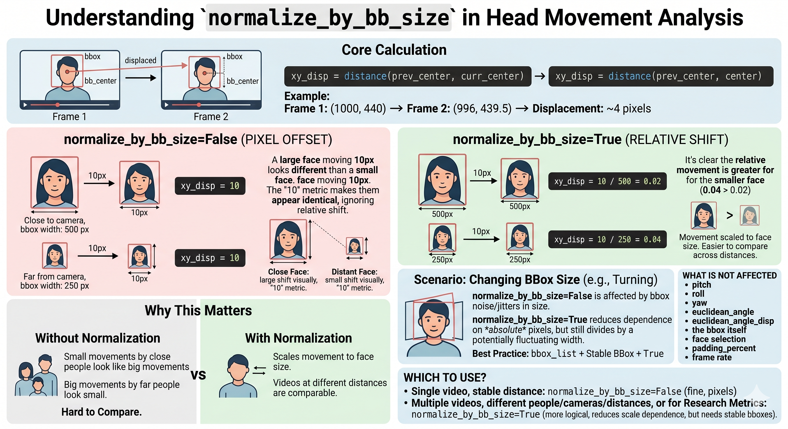
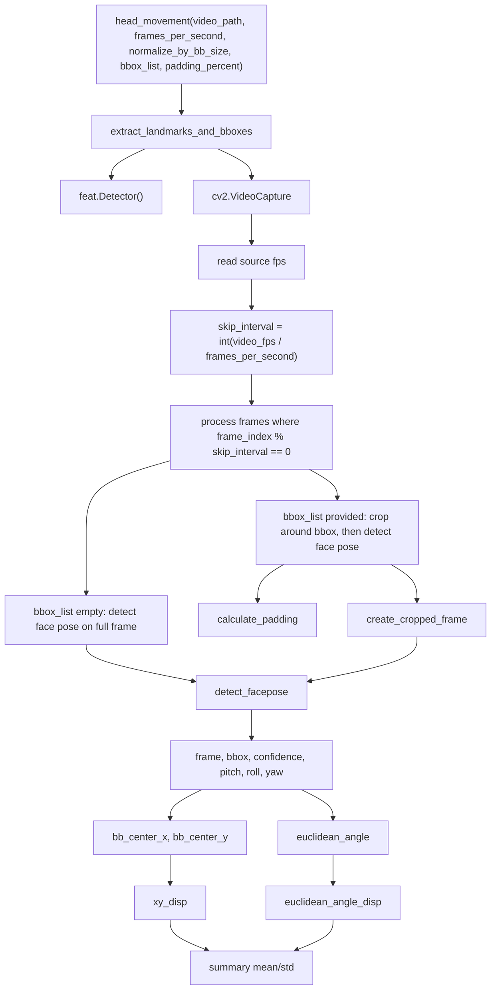

# Head Movement Feature Inventory and Rationale Notes

This note documents the local `openwillis.face.head_movement()` output surface that was added to this workspace from upstream OpenWillis, with practical interpretation notes for AIREST-style video analysis.

It is based on:

- `openwillis-face/src/openwillis/face/head_movement.py`
- `openwillis-face/src/openwillis/face/preprocess_video.py`
- `openwillis-face/src/openwillis/face/util/crop_utils.py`
- `demo_openwillis_face.ipynb`
- local validation on `video.mov`
- OpenDBM head movement definitions
- clinical-video literature on head movement, facial behavior, and psychiatric symptom measurement

## Entry Point

Notebook usage:

```python
import openwillis.face as owf

head_movement_df, summary_df = owf.head_movement(
    video_path="video.mov",
    frames_per_second=3,
    normalize_by_bb_size=False,
    bbox_list=[],
    padding_percent=0.1,
)

print("head_movement_df shape:", head_movement_df.shape)
print("summary_df shape:", summary_df.shape)
```

Validated local output on `video.mov`:

| Object | Shape | Meaning |
| --- | ---: | --- |
| `head_movement_df` | `(644, 15)` | One row per source-video frame, with valid measurements only on sampled frames. |
| `summary_df` | `(1, 10)` | Mean and standard deviation summaries for movement and pose features. |

## Concept Figure

The key implementation choice for `xy_disp` is whether to leave movement in absolute pixels or scale it by face size.



## Implementation Pipeline



Important behavior: the function keeps rows for all original frames, but only analyzes sampled frames. For a 30 fps video and `frames_per_second=3`, valid detections appear every 10 frames. The unsampled frames are filled with `NaN` placeholders.

## Sampling Contract

`frames_per_second` controls the target analysis rate, not the video playback rate.

The implementation computes:

```python
skip_interval = max(1, int(video_fps / frames_per_second))
```

For local `video.mov`, `video_fps == 30.0`.

| `frames_per_second` | Processed frame pattern at 30 fps | Interpretation |
| ---: | --- | --- |
| `3` | `0, 10, 20, 30, ...` | Sparse, fast exploratory analysis. |
| `5` | `0, 6, 12, 18, ...` | Still coarse for framewise movement. |
| `10` | `0, 3, 6, 9, ...` | Practical compromise for quick checks. |
| `15` | `0, 2, 4, 6, ...` | Reasonable compromise for research-style summaries. |
| `30` | `0, 1, 2, 3, ...` | Native frame rate for local video; best comparability for framewise movement. |

For final AIREST analysis, prefer `15` or `30` fps unless runtime is prohibitive. Sparse settings like `3` fps are useful for smoke tests but change the meaning of displacement because consecutive analyzed frames are farther apart in time.

## Runtime Reference

Reported local timings for a single source file:

- file: `11.7 MB`
- video: `1080p`, `MPEG-4 AAC`, `H.264`, stereo
- duration: `21s`
- source fps: `30`

`avg sec per frame` below is computed against the approximate number of analyzed frames:

```text
analyzed_frames ~= duration_seconds * frames_per_second
```

This is the relevant denominator for runtime, because `head_movement()` only runs pose estimation on sampled frames.

| fps count | bbox_computed | spent time | approx analyzed frames | avg sec per frame |
| ---: | --- | ---: | ---: | ---: |
| `1` | `False` | `14.4s` | `21` | `0.69s` |
| `3` | `False` | `1m4s` | `63` | `1.02s` |
| `10` | `False` | `1m43s` | `210` | `0.49s` |
| `15` | `False` | `2m34s` | `315` | `0.49s` |
| `25` | `False` | `5m17s` | `525` | `0.60s` |
| `30` | `False` | `5m7s` | `630` | `0.49s` |

If bbox computation is included as a separate preprocessing stage:

| fps count | bbox_computed | spent time | approx analyzed frames | avg sec per frame |
| ---: | --- | ---: | ---: | ---: |
| `30` | `True` | `1m13s` bbox preprocessing only | `630` | `0.12s` |
| `30` | `True` | `4m46s` combined (`3m33s + 1m13s`) | `630` | `0.45s` |

Additional measurements where bbox preprocessing is included once up front and then reused for head movement:

| fps count | bbox_computed | spent time | approx analyzed frames | avg sec per frame | avg sec per frame + bbox time |
| ---: | --- | ---: | ---: | ---: | ---: |
| `1` | `True` | `1m27s` (`14.4s + 1m13s`) | `21` | `0.69s` | `4.14s` |
| `3` | `True` | `1m37.5s` (`24.5s + 1m13s`) | `63` | `0.39s` | `1.55s` |
| `10` | `True` | `2m25s` (`1m12s + 1m13s`) | `210` | `0.34s` | `0.69s` |
| `15` | `True` | `3m2s` (`1m49s + 1m13s`) | `315` | `0.35s` | `0.58s` |
| `25` | `True` | `5m4s` (`3m51s + 1m13s`) | `525` | `0.44s` | `0.58s` |
| `30` | `True` | `4m46s` (`3m33s + 1m13s`) | `630` | `0.34s` | `0.45s` |

Additional measurements where bbox preprocessing was computed with `mediapipe`:

| fps count | bbox_computed | spent time | approx analyzed frames | avg sec per frame | avg sec per frame + bbox time |
| ---: | --- | ---: | ---: | ---: | ---: |
| `1` | `True` | `11s` | `21` | `0.52s` | `0.90s` |
| `3` | `True` | `25.4s` | `63` | `0.40s` | `0.53s` |
| `10` | `True` | `1m19s` | `210` | `0.38s` | `0.41s` |
| `15` | `True` | `1m57s` | `315` | `0.37s` | `0.40s` |
| `25` | `True` | `3m38.6s` | `525` | `0.42s` | `0.43s` |
| `30` | `True` | `3m45.5s` | `630` | `0.36s` | `0.37s` |

Notes:

- At `frames_per_second=3` on a `30 fps` source, valid pose rows appear every `10` source frames.
- The `30 fps` bbox-assisted timings are internally inconsistent if read as a single total: `3m33s + 1m13s = 4m46s`, not `5m7s`. This note preserves both reported values and the arithmetic sum so the benchmark history stays transparent.
- The mediapipe timings above treat `8s` as the one-time bbox preprocessing cost, then add it to the head-movement runtime for the combined column.
- The runtime is not perfectly monotonic because model warm-up, detector behavior, and full-frame versus cropped-frame inference all affect wall-clock time.

### Runtime Profiling Hook

`head_movement()` now has opt-in timing logs for the entry point and its helpers:

```python
head_movement_df, summary_df = owf.head_movement(
    video_path="sample_data/baseline.mp4",
    frames_per_second=30,
    normalize_by_bb_size=False,
    bbox_list=[],
    log_runtime=True,
    profile_log_every_n_frames=20,
)
```

Local diagnostic run on `sample_data/baseline.mp4` (`104` frames, `1080p`, `30 fps`, no bbox):

| Step | Total time | Calls | Avg per call | Share of total |
| --- | ---: | ---: | ---: | ---: |
| `head_movement()` | `63.011s` | `1` | `63.011s` | `100.0%` |
| `extract_landmarks_and_bboxes()` | `62.979s` | `1` | `62.979s` | `99.9%` |
| `sampled_frame_processing` | `60.404s` | `104` | `580.808ms` | `95.9%` |
| `detect_facepose` | `60.403s` | `104` | `580.794ms` | `95.9%` |
| `detector_init` | `2.307s` | `1` | `2.307s` | `3.7%` |
| `video_frame_read` | `0.252s` | `105` | `2.399ms` | `0.4%` |
| `compute_rotation_angles_vectorized` | `0.001s` | `1` | `1.479ms` | `0.0%` |
| `compute_xy_disp` | `0.001s` | `1` | `1.335ms` | `0.0%` |

Interpretation: for `frames_per_second=30` with `bbox_list=[]`, the bottleneck is py-feat `Detector.detect_facepose()` on full `1920x1080` frames. Video decoding and pandas/NumPy post-processing are negligible in comparison.

### Detector Backend Note

`preprocess_face_video()` defaults to `detector_backend="mtcnn"` in code, but for this workspace `mediapipe` is the better practical choice for bbox preprocessing.

| Backend | Practical quality in local use | Runtime | Notes |
| --- | --- | --- | --- |
| `mediapipe` | Generally cleaner and more stable bbox tracks | Faster | Preferred when the goal is to generate `bbox_list` for head movement. |
| `mtcnn` (default) | Less accurate/stable in local validation | Slower | More likely to produce artifacts such as jittery boxes, box jumps, and occasional false crops. |

When bbox quality is poor, downstream head-movement features such as `xy_disp` and `euclidean_angle_disp` become noisier.

## Optional BBox Source

`bbox_list=[]` means `head_movement()` detects face pose on the full frame. In that case, `padding_percent` has no effect.

To supply bbox tracks first:

```python
import openwillis.face as owf

bb_dict, facedata_df = owf.preprocess_face_video(
    "video.mov",
    n_people=1,
    detector_backend="mediapipe",
)

bbox_list = bb_dict[0]

head_movement_df, summary_df = owf.head_movement(
    video_path="video.mov",
    frames_per_second=3,
    normalize_by_bb_size=False,
    bbox_list=bbox_list,
    padding_percent=0.1,
)
```

`preprocess_face_video()` returns `bb_dict`, a mapping from face cluster id to framewise bbox dictionaries. The expected bbox keys are:

| Key | Meaning |
| --- | --- |
| `bb_x` | Left coordinate of the face bbox. |
| `bb_y` | Top coordinate of the face bbox. |
| `bb_w` | Width of the face bbox. |
| `bb_h` | Height of the face bbox. |
| `frame_idx` | Source video frame index. |

When bbox tracking is stable, using `bbox_list` can reduce failures on small faces, off-center faces, and multi-person scenes. Poor bbox tracks can make results worse because the pose detector receives an incorrect crop.

## Parameter Notes

### `padding_percent`

Used only when `bbox_list` is provided.

`padding_percent=0.1` means the crop is expanded by 10% of bbox width on the left and right and by 10% of bbox height on the top and bottom.

Practical interpretation:

| Value | Meaning | Risk |
| ---: | --- | --- |
| `0.0` | Tight bbox crop. | Can clip forehead, chin, hairline, or turned face. |
| `0.05` | Small context margin. | Good if bbox is already generous. |
| `0.1` | Moderate context margin. | Good default for stable bbox tracks. |
| `0.15-0.2` | Larger context margin. | Useful for tight or jittery bbox tracks. |
| `>0.2` | Wide crop. | More background; face becomes smaller inside the model input. |

### `normalize_by_bb_size`

This affects only `xy_disp`.

Without normalization:

```python
xy_disp = distance(previous_bbox_center, current_bbox_center)
```

The unit is pixels. This is easy to understand within one fixed-camera video, but it depends on how large the face appears in the frame.

With normalization:

```python
xy_disp = xy_disp / bbox_width
```

The unit becomes relative movement scaled by face size. This is usually better when comparing across videos, participants, camera distances, or devices.

What is not affected by `normalize_by_bb_size`:

| Not affected | Reason |
| --- | --- |
| `pitch` | Comes from pose estimation, not bbox-center displacement. |
| `roll` | Comes from pose estimation, not bbox-center displacement. |
| `yaw` | Comes from pose estimation, not bbox-center displacement. |
| `euclidean_angle` | Derived from pitch/yaw/roll. |
| `euclidean_angle_disp` | Derived from framewise change in `euclidean_angle`. |
| bbox selection | Controlled by detector or supplied `bbox_list`. |
| `padding_percent` | Crop margin only. |
| frame rate | Controlled by `frames_per_second`. |

## Framewise Output Inventory

`head_movement_df` contains the following columns.

| Column | Type | Meaning | Interpretation |
| --- | --- | --- | --- |
| `frame` | numeric | Original source-video frame index. | Useful for joining with other framewise outputs. |
| `bb_x1` | numeric | Left face bbox coordinate from py-feat format. | Raw face localization. |
| `bb_y1` | numeric | Top face bbox coordinate from py-feat format. | Raw face localization. |
| `bb_x2` | numeric | Right face bbox coordinate from py-feat format. | Raw face localization. |
| `bb_y2` | numeric | Bottom face bbox coordinate from py-feat format. | Raw face localization. |
| `face_confidence` | numeric | Detector confidence when no `bbox_list` is supplied; set to `1` when supplied bbox is used. | Use cautiously when `bbox_list` is supplied. |
| `pitch` | numeric | Up/down head rotation estimate. | Nodding direction or vertical head orientation. |
| `roll` | numeric | Side tilt head rotation estimate. | Lateral head tilt. |
| `yaw` | numeric | Left/right head rotation estimate. | Turning toward or away from camera/interviewer. |
| `time` | numeric | `frame / source_fps`, seconds. | Aligns movement with audio, speech, or task timing. |
| `bb_center_x` | numeric | Mean of `bb_x1` and `bb_x2`. | Horizontal face-center location. |
| `bb_center_y` | numeric | Mean of `bb_y1` and `bb_y2`. | Vertical face-center location. |
| `euclidean_angle` | numeric | Combined pitch/yaw/roll angle magnitude from rotation matrices. | Overall head orientation magnitude. |
| `euclidean_angle_disp` | numeric | Absolute difference in `euclidean_angle` across valid sampled frames. | Framewise angular movement/change. |
| `xy_disp` | numeric | BBox-center movement between valid sampled frames. | Translational image-plane movement. |

## Summary Output Inventory

`summary_df` contains one row with mean and standard deviation for selected features.

| Column | Source feature | Meaning |
| --- | --- | --- |
| `xy_disp_mean` | `xy_disp` | Average image-plane head displacement. |
| `pitch_mean` | `pitch` | Average vertical head orientation. |
| `yaw_mean` | `yaw` | Average left/right head orientation. |
| `roll_mean` | `roll` | Average lateral tilt. |
| `euclidean_angle_disp_mean` | `euclidean_angle_disp` | Average angular movement between sampled frames. |
| `xy_disp_std` | `xy_disp` | Variability of image-plane head displacement. |
| `pitch_std` | `pitch` | Variability of vertical orientation. |
| `yaw_std` | `yaw` | Variability of left/right orientation. |
| `roll_std` | `roll` | Variability of lateral tilt. |
| `euclidean_angle_disp_std` | `euclidean_angle_disp` | Variability of angular movement. |

`mean` features are useful for posture or average movement level. `std` features are often more directly interpretable as movement variability, instability, or expressiveness.

## Conceptual Interpretation

### Pose features

`pitch`, `yaw`, and `roll` describe orientation. They are useful when the research question concerns posture, gaze/head orientation, avoidance, engagement, or repetitive directional movement.

Candidate interpretations:

| Feature | High values may reflect | Low values may reflect | Caveats |
| --- | --- | --- | --- |
| `pitch_mean` | More upward/downward average head orientation. | More level head posture. | Camera angle can bias this. |
| `pitch_std` | More nodding or vertical movement variability. | Reduced vertical movement. | Speech and breathing can introduce small variation. |
| `yaw_mean` | More left/right average orientation. | More frontal orientation. | Off-center camera placement can bias this. |
| `yaw_std` | More turning/scanning. | Reduced side-to-side movement. | Multi-person interaction context matters. |
| `roll_mean` | More lateral head tilt. | More upright posture. | Camera rotation and seating posture matter. |
| `roll_std` | More tilt variability. | Reduced tilt variability. | Can be affected by tracking quality. |

### Movement features

`xy_disp` and `euclidean_angle_disp` describe change over time.

| Feature | Meaning | Best use |
| --- | --- | --- |
| `xy_disp` | BBox-center displacement in the image plane. | Coarse head/body movement in the camera frame. |
| `euclidean_angle_disp` | Combined angular change from pitch/yaw/roll. | Rotation-based head movement independent of bbox-center translation. |

For AIREST, use both. `xy_disp` captures visible shifts in image position; `euclidean_angle_disp` captures rotation even when the face stays near the same location.

## Clinical and Research Rationale

Head movement is not diagnostic by itself. It is a behavioral signal that can contribute to multi-modal assessment when combined with speech, facial expressivity, blink rate, emotional expression, task context, and clinical labels.

Relevant literature anchors:

- OpenDBM defines head movement through framewise Euclidean movement plus pitch/yaw/roll and summary mean/std features, closely matching this local inventory. See [OpenDBM Head Movement](https://aicure.github.io/open_dbm/docs/head-movement).
- Smartphone video work in schizophrenia reported reduced head movement rate in schizophrenia and associations with symptom severity, especially negative symptoms. See [Computer Vision-Based Assessment of Motor Functioning in Schizophrenia](https://pmc.ncbi.nlm.nih.gov/articles/PMC7879301/).
- Multimodal psychiatric classification work has used head posture features including roll, pitch, and yaw alongside speech, facial, and motor features for schizophrenia and depression assessment. See [Identifying psychiatric manifestations in schizophrenia and depression from audio-visual behavioural indicators](https://pmc.ncbi.nlm.nih.gov/articles/PMC9640655/).
- Pain behavior research treats pitch, yaw, and roll as framewise head-pose orientation signals and summarizes head movement statistically. See [Head movements and postures as pain behavior](https://journals.plos.org/plosone/article?id=10.1371%2Fjournal.pone.0192767).
- Head motion patterns have also been explored in depression, anxiety, affective expression, and dyadic interaction settings, supporting head movement as a broad candidate behavioral marker rather than a condition-specific standalone endpoint.

## Candidate AIREST Hypotheses

These are candidate hypotheses for analysis planning, not clinical claims.

| Hypothesis area | Candidate feature pattern | Possible interpretation | Recommended controls |
| --- | --- | --- | --- |
| Psychomotor slowing or reduced expressivity | Lower `xy_disp_mean`, lower `euclidean_angle_disp_mean`, lower pose stds. | Less spontaneous head movement during interview or task. | Control for task, speaking time, camera distance, medication, fatigue. |
| Agitation or hyperarousal | Higher `xy_disp_mean`, higher `xy_disp_std`, higher `euclidean_angle_disp_std`. | More visible head motion or unstable movement. | Check body movement, frame quality, seating, camera shake. |
| Avoidance or disengagement | Sustained non-frontal `yaw_mean` or high yaw variability. | Looking away or scanning away from interviewer/task. | Requires task annotation and camera geometry. |
| Social engagement during speech | Head movement increases during speaking segments or turn-taking. | Conversational expressivity or listener feedback. | Pair with speech activity, mouth openness, audio diarization. |
| Negative symptom burden | Lower movement summaries across interview. | Candidate marker of motor or expressive reduction. | Compare with clinical negative symptom scales and facial expressivity. |
| Anxiety-related motor behavior | Higher short-term movement variability, especially angular displacement. | Candidate marker of restlessness or tension. | Distinguish head motion from camera motion and task prompts. |
| Robustness/quality marker | High `face_confidence`, low missingness, stable bbox width. | More reliable video sample. | Report missingness and detection failures before clinical interpretation. |

## Recommended AIREST Usage

For quick notebook exploration:

```python
head_movement_df, summary_df = owf.head_movement(
    video_path="video.mov",
    frames_per_second=10,
    normalize_by_bb_size=False,
    bbox_list=[],
    padding_percent=0.1,
)
```

For more research-aligned measurement on local `30 fps` video:

```python
head_movement_df, summary_df = owf.head_movement(
    video_path="video.mov",
    frames_per_second=30,
    normalize_by_bb_size=True,
    bbox_list=[],
    padding_percent=0.1,
)
```

For videos with small faces, multiple people, or unstable detection:

```python
bb_dict, facedata_df = owf.preprocess_face_video(
    "video.mov",
    n_people=1,
    detector_backend="mediapipe",
)

bbox_list = bb_dict[0]

head_movement_df, summary_df = owf.head_movement(
    video_path="video.mov",
    frames_per_second=15,
    normalize_by_bb_size=True,
    bbox_list=bbox_list,
    padding_percent=0.1,
)
```

Recommended defaults for AIREST pilots:

| Scenario | Suggested settings |
| --- | --- |
| Smoke test | `frames_per_second=3`, `bbox_list=[]`, `normalize_by_bb_size=False` |
| Single stable video | `frames_per_second=15 or 30`, `normalize_by_bb_size=False or True` |
| Cross-video comparison | `frames_per_second=15 or 30`, `normalize_by_bb_size=True` |
| Multi-person or small-face video | generate `bbox_list` with `preprocess_face_video()`, then use `normalize_by_bb_size=True` |

## Quality Checks Before Interpretation

Run these checks before using the summary as a clinical or research feature set.

```python
valid = head_movement_df.dropna(subset=["face_confidence"])
missing_rate = 1 - (len(valid) / len(head_movement_df))

print("valid sampled rows:", len(valid))
print("missing/unsampled row rate:", missing_rate)
print("summary columns:", list(summary_df.columns))
```

For sparse runs, also inspect only sampled rows:

```python
sampled_head_movement_df = (
    head_movement_df
    .dropna(subset=["face_confidence"])
    .reset_index(drop=True)
)

sampled_head_movement_df.head()
```

Recommended reporting fields:

| Report field | Why it matters |
| --- | --- |
| Source fps | Determines spacing between analyzed frames. |
| `frames_per_second` | Determines temporal resolution. |
| Number of valid sampled rows | Captures usable pose estimates. |
| Missing rate among sampled frames | Captures detection robustness. |
| `bbox_list` source | Full-frame detection vs preprocessed face track. |
| `normalize_by_bb_size` | Determines whether `xy_disp` is pixel-based or relative. |
| `padding_percent` | Relevant only when `bbox_list` is supplied. |

## Limitations

- `head_movement_df` is sparse when `frames_per_second` is below source fps; unsampled rows are intentionally filled with `NaN`.
- `xy_disp` is based on bbox-center motion, so camera movement, body lean, and bbox jitter can influence it.
- `normalize_by_bb_size=True` improves cross-video comparability but can amplify bbox-width noise if bbox estimates are unstable.
- `face_confidence` is not comparable across modes: supplied bbox mode sets confidence to `1`.
- Mean/std summaries are useful first-order features, but they do not capture rhythm, synchrony, temporal bursts, or task-specific timing without additional feature engineering.

## Bottom Line

For AIREST, head movement should be treated as a behavioral feature family:

- `pitch`, `yaw`, and `roll` describe head orientation.
- `xy_disp` describes image-plane face-center movement.
- `euclidean_angle_disp` describes rotational movement over time.
- summary means and standard deviations provide compact candidate features for modeling and hypothesis testing.

The strongest default for cross-video research is a stable bbox strategy, `frames_per_second=15` or `30`, and `normalize_by_bb_size=True`, with missingness and detection quality reported alongside every result.
