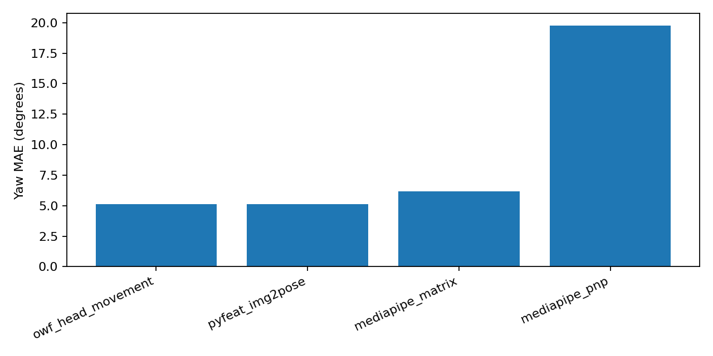
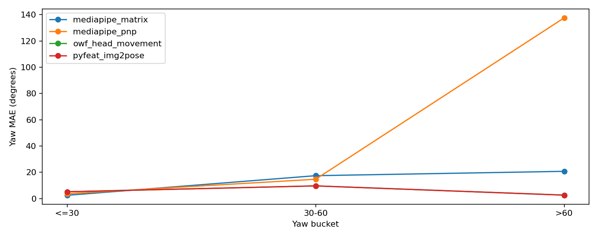
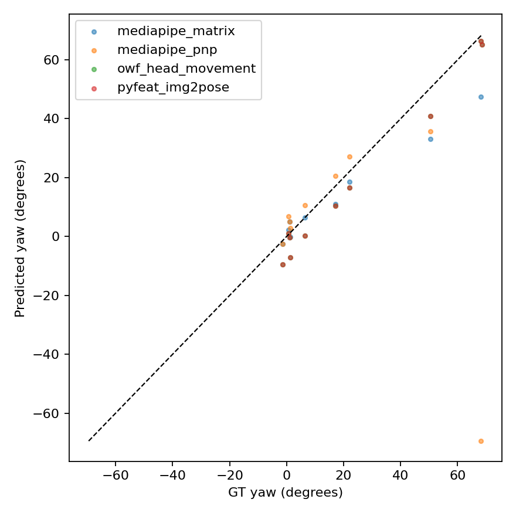
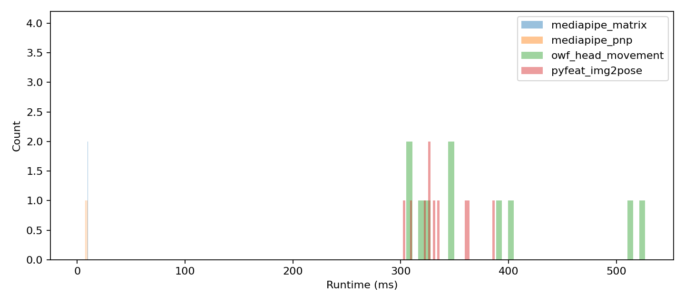
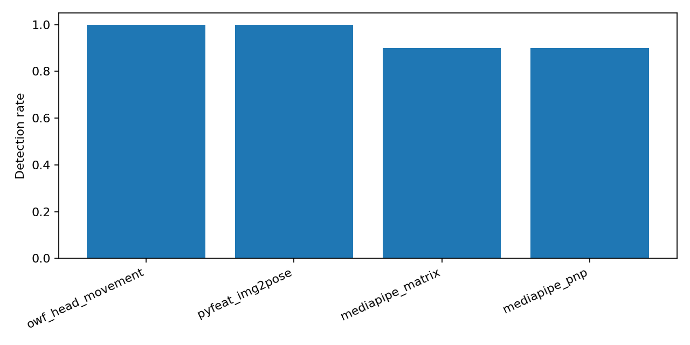

# MediaPipe Head Pose Migration Report

## Scope

This document summarizes the work completed around replacing the current `owf.head_movement()` pose path with a MediaPipe-based alternative.

The work is grounded in three artifacts:

1. [aflw2000_head_pose_evaluation.ipynb](/Users/pelmeshek1706/Desktop/projects/airest-face/head_pose_eval/notebooks/aflw2000_head_pose_evaluation.ipynb)  
   `3DDFA AFLW2000-3D cropped yaw-only` benchmark.
2. [mediapipe_head_movement_parity_test.ipynb](/Users/pelmeshek1706/Desktop/projects/airest-face/head_movement/mediapipe_head_movement_parity_test.ipynb)  
   direct parity test against `owf.head_movement()` on video.
3. [mediapipe_head_movement_pipeline_demo.ipynb](/Users/pelmeshek1706/Desktop/projects/airest-face/head_movement/mediapipe_head_movement_pipeline_demo.ipynb)  
   production-style split into `MediapipeAnalyzer` and `HeadMovement`.

The headline conclusion is straightforward:

- `mediapipe_matrix` is the only realistic replacement candidate for `owf`
- it is much faster than `owf`
- its current accuracy gap to `owf` is small enough to justify migration work
- `mediapipe_pnp` is not stable enough to use as the primary path

## What Was Implemented

### 1. Yaw-only benchmark notebook

The benchmark in [aflw2000_head_pose_evaluation.ipynb](/Users/pelmeshek1706/Desktop/projects/airest-face/head_pose_eval/notebooks/aflw2000_head_pose_evaluation.ipynb) was rewritten around the actual available dataset:

- input: `3DDFA` preprocessed `AFLW2000-3D_crop`
- ground truth: `AFLW2000-3D.pose.npy`
- metric scope: `yaw`, `detection_rate`, `runtime`

This is not a full `pitch/yaw/roll` benchmark because the available dataset bundle does not contain the original AFLW2000 `.mat Pose_Para` files.

### 2. Video parity notebook

[mediapipe_head_movement_parity_test.ipynb](/Users/pelmeshek1706/Desktop/projects/airest-face/head_movement/mediapipe_head_movement_parity_test.ipynb) compares:

- `owf.head_movement()`
- `mediapipe_matrix`
- `mediapipe_pnp`

on a real video sequence.

This notebook is not an accuracy benchmark to ground truth. It is a parity benchmark against the current OpenWillis output surface.

### 3. Production-style class split

[mediapipe_head_movement_pipeline_demo.ipynb](/Users/pelmeshek1706/Desktop/projects/airest-face/head_movement/mediapipe_head_movement_pipeline_demo.ipynb) implements:

- `MediapipeAnalyzer`
- `HeadMovement`

The intended architecture is:

```text
video frame
  -> MediapipeAnalyzer
  -> per-frame record with landmarks + facial_transformation_matrix + bbox + metadata
  -> HeadMovement.analyze(...)
  -> framewise dataframe + summary dataframe
```

This keeps MediaPipe inference single-pass and makes `HeadMovement` a cheap post-processing stage.

## Methods Compared

### `owf_head_movement`

Current OpenWillis implementation based on `py-feat` / `img2pose`.

Characteristics:

- direct face pose estimator
- slow on CPU
- serves as the current reference behavior

### `mediapipe_matrix`

Pose is derived from MediaPipe `FaceLandmarker` using:

- `face_landmarks`
- `facial_transformation_matrixes`

Pipeline:

```text
FaceLandmarker
  -> 4x4 facial transformation matrix
  -> top-left 3x3 rotation matrix
  -> Euler angles
  -> pitch / roll / yaw
```

Characteristics:

- fast
- stable on video
- directly compatible with a single-pass MediaPipe pipeline
- requires a convention layer because its raw Euler sign conventions do not match `owf`

### `mediapipe_pnp`

Pose is derived from MediaPipe landmarks through `cv2.solvePnP` using a small fixed 3D face model.

Pipeline:

```text
selected 2D facial landmarks
  + generic 3D face template
  + approximate camera intrinsics
  -> solvePnP
  -> rotation matrix
  -> Euler angles
```

Characteristics:

- fast
- mathematically plausible
- unstable in practice in the current setup

## Benchmark Results

### 1. AFLW2000 yaw-only benchmark

Important: the currently saved `head_pose_eval/outputs` correspond to a `LIMIT=10` dry run, not the full 2000-image benchmark. The results are still useful for direction and relative behavior.

### Main metrics

Source: [metrics_summary.csv](/Users/pelmeshek1706/Desktop/projects/airest-face/head_pose_eval/outputs/metrics/metrics_summary.csv)

| Method | Detection rate | Runtime mean, ms | Yaw MAE, deg |
| --- | ---: | ---: | ---: |
| `owf_head_movement` | 1.00 | 378.61 | 5.14 |
| `pyfeat_img2pose` | 1.00 | 336.48 | 5.14 |
| `mediapipe_matrix` | 0.90 | 7.98 | 6.20 |
| `mediapipe_pnp` | 0.90 | 7.64 | 19.78 |

Key observations:

- `mediapipe_matrix` is only `1.06°` worse than `owf` on yaw MAE in the current dry run
- `mediapipe_matrix` is about `47.5x` faster than `owf` on this benchmark
- `mediapipe_pnp` is dramatically worse than both `owf` and `mediapipe_matrix`

### Yaw bucket behavior

Source: [metrics_by_yaw_bucket.csv](/Users/pelmeshek1706/Desktop/projects/airest-face/head_pose_eval/outputs/metrics/metrics_by_yaw_bucket.csv)

For low yaw (`<=30°`), `mediapipe_matrix` is actually better than `owf` in the current dry run:

- `mediapipe_matrix`: `2.51°`
- `owf_head_movement`: `5.20°`

Its current weakness is larger yaw, where the small dry-run sample is also thin:

- `30-60°`: `17.45°`
- `>60°`: `20.77°`

`mediapipe_pnp` breaks down badly at high yaw:

- `>60°`: `137.63°`

### Plots

Yaw MAE:



Yaw MAE by bucket:



GT vs predicted yaw:



Runtime:



Detection rate:



### 2. Video parity benchmark against `owf`

Source: [mediapipe_head_movement_parity_test.ipynb](/Users/pelmeshek1706/Desktop/projects/airest-face/head_movement/mediapipe_head_movement_parity_test.ipynb)

This benchmark measures parity to the current OpenWillis output, not ground-truth accuracy.

### Runtime

| Pipeline | ms per frame |
| --- | ---: |
| `owf.head_movement` | 641.83 |
| `mediapipe.matrix_raw` | 14.98 |
| `mediapipe.pnp_raw` | 14.99 |

Key observation:

- `mediapipe_matrix` is about `42.8x` faster than `owf` on the tested video

### Raw parity to `owf`

For `mediapipe_matrix` vs `owf`, overlap metrics on valid frames were:

| Metric | Mean absolute diff |
| --- | ---: |
| `pitch` | 26.07° |
| `roll` | 10.47° |
| `yaw` | 33.48° |
| `bbox center L2` | 29.17 px |

These raw angle gaps look large, but they must be interpreted correctly:

- this is not ground truth
- `owf` and MediaPipe use different pose conventions
- the raw curves can look mirrored even when the relative motion is coherent

That is why the parity notebook showed visually mirrored raw trajectories in some plots while the baseline-calibrated outputs still looked reasonable.

### Why the mirrored curves happen

`mediapipe_matrix` and `owf` do not share the same axis/sign convention out of the box.

In practice:

- `owf` uses `img2pose` conventions
- `mediapipe_matrix` derives Euler angles from MediaPipe transformation matrices

So raw `pitch/yaw/roll` can disagree in sign even when both methods are tracking the same physical motion. This is a convention mismatch, not necessarily a failure of the MediaPipe method.

That behavior is already visible in the yaw-only benchmark, where `mediapipe_matrix` required `invert_yaw` in [convention_mapping.json](/Users/pelmeshek1706/Desktop/projects/airest-face/head_pose_eval/outputs/metrics/convention_mapping.json).

### 3. Production-style pipeline benchmark

Source: [mediapipe_head_movement_pipeline_demo.ipynb](/Users/pelmeshek1706/Desktop/projects/airest-face/head_movement/mediapipe_head_movement_pipeline_demo.ipynb)

On `video.mov`:

- `MediapipeAnalyzer`: `644/644` valid frames, `15.95 ms/frame`
- `HeadMovement raw` post-processing: `0.056 ms/frame`
- `HeadMovement relative_smoothed` post-processing: `0.080 ms/frame`

This is important operationally:

- the expensive step is MediaPipe inference
- once per-frame MediaPipe records exist, `HeadMovement` is essentially free

## Why `mediapipe_matrix` Is the Right Production Direction

### 1. It matches the real production architecture

The target production setup is:

- run MediaPipe once per frame
- persist its outputs
- reuse them across multiple downstream analyzers

`mediapipe_matrix` fits this directly because it needs only:

- landmarks
- facial transformation matrix
- bbox derived from landmarks

`owf` does not fit this architecture well because it runs a separate pose model.

### 2. It is much faster

Across both image and video evaluation:

- image dry run: about `47.5x` faster than `owf`
- video parity run: about `42.8x` faster than `owf`

This speed difference is large enough to matter at production scale.

### 3. The current accuracy gap is small enough to work with

On the current yaw-only dry run:

- `owf`: `5.14°`
- `mediapipe_matrix`: `6.20°`

That is a gap of only `1.06°`.

This is the core migration argument:

- `mediapipe_matrix` is not identical to `owf`
- but it is close enough in accuracy and dramatically better in speed

For head-movement use cases, where relative motion is often more important than absolute pose, this tradeoff is favorable.

## Why `mediapipe_pnp` Does Not Work Well Enough

The current `mediapipe_pnp` path fails for structural reasons, not just tuning noise.

### 1. The 3D model is too generic

`solvePnP` assumes correspondence between:

- 2D observed image points
- 3D object points

The current setup uses a small fixed generic face model. That model does not align tightly enough with MediaPipe landmark geometry across different poses and identities.

### 2. The method is very sensitive to rotation convention

`solvePnP` returns object-to-camera pose. If Euler extraction assumes the inverse convention, the result can flip signs or explode on one or more axes.

This is one major reason the current PnP outputs show pathological pitch behavior.

### 3. The camera intrinsics are only approximated

The current approach uses rough intrinsics. That can be acceptable for coarse pose, but it makes the solve unstable under large head rotations.

### 4. The current point set is too fragile

Using a small set of points such as:

- nose
- chin
- eye corners
- mouth corners

is enough to solve PnP mathematically, but not enough to make it robust in this setup.

### 5. The observed failure pattern is severe

The failures are not marginal:

- yaw-only dry run: `19.78°` yaw MAE overall
- `>60°` yaw bucket: `137.63°`
- video parity:
  - `pitch`: `154.78°` mean absolute diff
  - `roll`: `45.89°`
  - `yaw`: `25.39°`

That is not tuning drift. That is a method that is currently the wrong primary path.

## Recommended Production Architecture

### Analyzer stage

Use a single `MediapipeAnalyzer` pass per video frame and persist records with:

- `frame_index`
- `timestamp_ms`
- `face_count`
- `landmarks_norm_xyz`
- `transform_matrix_4x4`
- `bbox_xyxy_px`
- `bb_center_x`
- `bb_center_y`
- `face_scale_px`
- `valid_for_head_pose`
- `failure_reason`
- optional `blendshapes`

### Head movement stage

Feed a narrowed subset of those records into `HeadMovement`:

- `transform_matrix_4x4`
- `bbox_xyxy_px`
- `frame_index`
- `timestamp_ms`
- `time_seconds`
- `face_count`
- `valid_for_head_pose`

Then expose two modes:

1. `raw`  
   for debug and absolute-pose inspection
2. `relative_smoothed`  
   for production head-movement features

### Convention handling

Keep a small explicit convention layer between MediaPipe rotation matrices and the final `pitch/roll/yaw` surface. This is required because raw MediaPipe Euler conventions do not match `owf` conventions directly.

## Final Recommendation

Use `mediapipe_matrix` as the production replacement candidate for `owf` head pose inside a single-pass MediaPipe pipeline.

Do not use `mediapipe_pnp` as the primary path.

The reasoning is:

1. `mediapipe_matrix` is operationally aligned with the production architecture
2. it is roughly `40x+` faster than `owf`
3. its current accuracy gap to `owf` is small
4. its remaining issues are mostly convention and calibration issues, not fundamental instability
5. `mediapipe_pnp` shows fundamental instability in the current setup, especially on larger poses

## Recommended Next Steps

1. Run the full `AFLW2000` yaw-only benchmark with `LIMIT=None` and save the final metrics.
2. Add explicit sign / transpose convention experiments for `mediapipe_matrix` in the parity notebook.
3. Move `MediapipeAnalyzer` and `HeadMovement` from the demo notebook into package code.
4. Keep `relative_smoothed` as the default production mode for head-movement features.
5. Add movement-oriented metrics on top of MediaPipe:
   - angular velocity
   - angular acceleration
   - cumulative rotation path
   - z/scale movement
   - gap and reacquisition metrics
