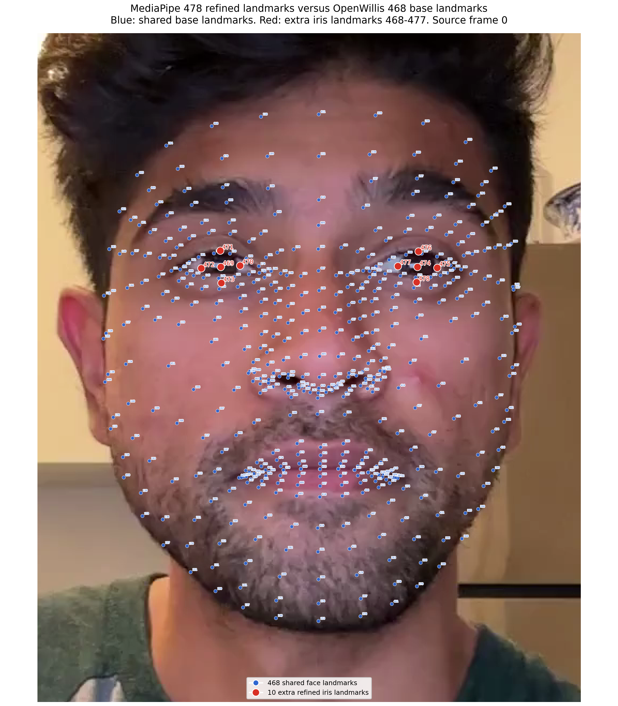

# AIREST Gaze and OpenWillis Landmark Compatibility Note

Reviewed on: 2026-05-27

## Purpose

This note checks whether the current AIREST gaze pipeline in `/Users/pelmeshek1706/Desktop/projects/airest-gaze/airest_cv` matches the OpenWillis facial landmark indexing convention and coordinate transforms described in [OpenWillis Landmark Output Schema Note](openwillis_landmark_schema_note.md). It records incompatibilities that affect schema mapping and downstream facial-displacement features.

Local AIREST gaze sources reviewed:

- [`src/tracking/gaze_tracking.py`](../../airest-gaze/airest_cv/src/tracking/gaze_tracking.py)
- [`src/tracking/eye.py`](../../airest-gaze/airest_cv/src/tracking/eye.py)
- [`src/tracking/point_of_gaze.py`](../../airest-gaze/airest_cv/src/tracking/point_of_gaze.py)
- [`src/calibration/gaze_calibration.py`](../../airest-gaze/airest_cv/src/calibration/gaze_calibration.py)
- [`src/api.py`](../../airest-gaze/airest_cv/src/api.py)
- [`examples/api_test.py`](../../airest-gaze/airest_cv/examples/api_test.py)
- [`webapp.py`](../../airest-gaze/airest_cv/webapp.py)
- [`docs/current_repo_data_schema.md`](../../airest-gaze/airest_cv/docs/current_repo_data_schema.md)
- [`docs/gaze_part_structure.md`](../../airest-gaze/airest_cv/docs/gaze_part_structure.md)
- Prototype outputs in `api_test_results/calibration_test_landmarks.csv` and `api_test_results/evaluation_landmarks.csv`

## Short Conclusion

The current AIREST gaze pipeline does not directly match the OpenWillis landmark output schema.

AIREST uses MediaPipe FaceMesh with `refine_landmarks=True`, stores MediaPipe landmark IDs as zero-based integers, and prototype CSVs include 478 landmarks with IDs `0..477`. OpenWillis uses the base 468 Face Mesh landmarks, names them as one-based columns `lmk001..lmk468`, and excludes iris/refined landmarks `468..477` from its schema.

AIREST exports raw MediaPipe normalized landmark coordinates, not OpenWillis-normalized coordinates. It does not center landmarks on a nose/face anchor, scale by eye distance, or align the eye line before saving landmarks. However, AIREST does transform selected eye/iris landmarks into pixel-space eye ratios for gaze calibration, and the active web/example paths horizontally flip frames before running MediaPipe. That flip changes the coordinate basis relative to OpenWillis outputs from the unflipped video.

## Visual Difference: 468 Versus 478

The figure below uses the same face frame as the OpenWillis landmark visualizations. Blue dots are the 468 shared MediaPipe base face landmarks used by OpenWillis. Red dots are the 10 additional refined iris landmarks returned when MediaPipe FaceMesh runs with `refine_landmarks=True`.



Artifacts:

| View | PNG | SVG |
| --- | --- | --- |
| 478 refined landmarks versus 468 OpenWillis base landmarks | [PNG](assets/openwillis_landmarks/mediapipe_478_vs_openwillis_468_numbered.png) | [SVG](assets/openwillis_landmarks/mediapipe_478_vs_openwillis_468_numbered.svg) |

Interpretation:

- The 10 extra points are localized around the irises/pupils, five per eye.
- They correspond to MediaPipe IDs `468..477`, so they do not have OpenWillis `lmk001..lmk468` names.
- These points are useful for AIREST gaze estimation because the current gaze code uses iris-center IDs `468` and `473`.
- They should not be included in OpenWillis facial expressivity displacement unless OpenWillis region definitions and `overall` semantics are intentionally extended.

## Indexing Compatibility

| Area | AIREST current behavior | OpenWillis behavior | Compatibility impact |
| --- | --- | --- | --- |
| Landmark model | `mp.solutions.face_mesh.FaceMesh(refine_landmarks=True)` in `GazeTracking` | `mp.solutions.face_mesh.FaceMesh(...)` with `NUM_LANDMARKS = 468` | AIREST can return 478 landmarks; OpenWillis maps only the first 468. |
| Landmark IDs in exports | `landmark_id` is emitted by `enumerate(...)`, so IDs are zero-based MediaPipe indices | Columns are one-based labels `lmk001..lmk468` | Map `landmark_id=0` to `lmk001`, ..., `landmark_id=467` to `lmk468`; do not map `468..477` into OpenWillis columns. |
| Iris landmarks | AIREST uses `LEFT_IRIS_CENTER = 468`, `RIGHT_IRIS_CENTER = 473` and visualization code uses iris IDs up to `477` | OpenWillis schema excludes refined iris landmarks | Iris/pupil proxy fields need a separate AIREST gaze schema, not OpenWillis facial displacement columns. |
| Prototype CSV evidence | Current sample `calibration_test_landmarks.csv` has IDs `0..477`; `evaluation_landmarks.csv` also has IDs `0..477` | Expected OpenWillis columns stop at `lmk468` | Any converter must filter or sidecar the final 10 iris landmarks. |

## Coordinate Transform Compatibility

| Coordinate or feature | AIREST current behavior | OpenWillis behavior | Compatibility impact |
| --- | --- | --- | --- |
| Exported landmark coordinates | Saves `lm.x`, `lm.y`, `lm.z` directly from MediaPipe | Raw `get_landmarks()` also starts from MediaPipe `x/y/z`, but `facial_expressivity(normalize=True)` then normalizes by default | AIREST raw landmark CSVs are only comparable to OpenWillis raw, pre-normalization coordinates, not default OpenWillis `framewise_loc`. |
| X/Y scale | MediaPipe normalized x/y in `[0, 1]` relative to processed frame dimensions | Same for raw MediaPipe; OpenWillis normalized output is centered/scaled and no longer `[0, 1]` | Mapping must include `coordinate_space = raw_mediapipe_normalized` for AIREST exports. |
| Z scale | MediaPipe relative depth from model output | Same for raw MediaPipe; OpenWillis displacement may be computed after normalization | Z is compatible only before OpenWillis normalization. |
| Nose anchor | No exported landmark centering around nose or other face anchor | OpenWillis default normalization subtracts `lmk001` from all landmarks | AIREST landmarks cannot be used as OpenWillis-normalized displacement input unless the same centering/scaling transform is applied first. |
| Eye-distance scaling | Not applied to exported landmarks | OpenWillis divides coordinates by the 3D distance between `lmk144` and `lmk373` when `normalize=True` | Raw AIREST frame-to-frame displacement will be sensitive to face size and camera distance; OpenWillis normalized displacement is face-size adjusted. |
| Eye-line alignment | Not applied to exported landmarks | Optional OpenWillis `align=True` rotates coordinates around z so the eye line is horizontal; default top-level `align=False` | AIREST exports should be treated as unaligned. If aligning later, record the transform. |
| Horizontal frame flip | Web and example flows call `cv2.flip(frame, 1)` before API processing | OpenWillis processes decoded frames without a flip | AIREST x coordinates and left/right semantics may be mirror-space relative to the saved raw video unless the stored video is also flipped. |
| Pixel-space gaze features | `Eye` converts selected landmark x/y to frame pixels and computes ratios inside eye boundaries; `PointOfGaze` maps ratios to screen pixels | OpenWillis facial landmark output is not gaze-calibrated screen coordinates | Gaze ratios and screen coordinates are derived features and must not be mixed into OpenWillis landmark/displacement tables. |

## AIREST Gaze Transform Details

The AIREST gaze path stores raw landmarks and separately derives gaze features:

1. `GazeTracking.refresh(frame)` stores the frame and calls `_analyze_frame()`.
2. `_analyze_frame()` converts BGR to RGB, runs MediaPipe FaceMesh, stores `results.multi_face_landmarks[0].landmark`, and builds `Eye` objects.
3. `Eye` converts selected boundary landmarks from normalized MediaPipe x/y to pixel coordinates using frame width/height.
4. `Eye` reads iris-center landmarks at MediaPipe IDs `468` and `473` and stores those pixel coordinates in `Pupil`.
5. `GazeTracking.horizontal_ratio()` averages each eye's iris position within the eye x-bounds.
6. `GazeTracking.vertical_ratio()` currently uses `pupil.y / (2 * eye.center.y)` rather than `Eye.get_vertical_ratio()`, so it depends on absolute eye position in the frame.
7. `GazeCalibration` fits a second-order polynomial from horizontal/vertical ratios to screen target pixels.
8. `PointOfGaze` applies the polynomial and optionally stabilizes screen gaze points with recent-point clusters.

These transforms are gaze-calibration transforms. They are not OpenWillis landmark normalization, and they should not be interpreted as nose-anchored, eye-distance-scaled, or eye-line-aligned landmarks.

## Current Output Schemas Compared

### AIREST Calibration Landmark CSV

Current producer: `GazeTrackerAPI.save_calibration_test_data()`.

Current header:

```csv
frame_idx,point_idx,landmark_id,x,y,z
```

Semantics:

- `frame_idx`: test-stage frame counter, not original camera frame index.
- `point_idx`: calibration/test point index.
- `landmark_id`: zero-based MediaPipe index, observed `0..477` in current sample output.
- `x`, `y`, `z`: raw MediaPipe normalized coordinates from the processed frame.

### AIREST Evaluation Landmark CSV

Current producer: `examples/api_test.py`.

Current header:

```csv
stimulus_frame,landmark_id,x,y,z
```

Semantics:

- `stimulus_frame`: frame counter from the displayed stimulus video, not the gaze camera frame.
- `landmark_id`: zero-based MediaPipe index, observed `0..477` in current sample output.
- `x`, `y`, `z`: raw MediaPipe normalized coordinates from the processed gaze camera frame.

### OpenWillis Framewise Location

OpenWillis `framewise_loc` uses wide columns:

```text
frame,time,lmk001_x,...,lmk468_x,lmk001_y,...,lmk468_y,lmk001_z,...,lmk468_z
```

or, after local normalization, the same landmark coordinate names with `frame` and `time` appended after the coordinate columns. The meaning is not identical to AIREST CSV rows because OpenWillis uses one row per video frame and one column per landmark-axis pair.

## Incompatibilities Affecting Displacement Features

| Incompatibility | Why it matters | Mapping requirement |
| --- | --- | --- |
| 478 refined landmarks versus 468 OpenWillis landmarks | OpenWillis displacement and region summaries are defined only for `lmk001..lmk468`; iris IDs `468..477` would create extra columns with no OpenWillis region membership. | Filter AIREST IDs `0..467` for OpenWillis-compatible face displacement; store iris IDs separately. |
| Zero-based IDs versus one-based `lmkNNN` labels | Direct string joins will be off by one. | Convert with `lmk{landmark_id + 1:03d}` for IDs `0..467`. |
| Raw MediaPipe coordinates versus OpenWillis normalized coordinates | Frame-to-frame Euclidean displacement changes substantially when centering/scaling is applied. | Store coordinate-space metadata and do not compare raw AIREST displacement to default OpenWillis displacement unless AIREST applies the same transform. |
| Horizontal flip before MediaPipe | The exported AIREST x-coordinate basis can be mirror-space relative to the original captured video. | Record `image_transform = horizontal_flip_before_mediapipe` or process the same frame orientation across systems. |
| No gaze-camera frame index in evaluation landmarks | `stimulus_frame` is not the camera frame used for MediaPipe inference. | Add `camera_frame_idx`, `camera_timestamp`, and `stimulus_frame_idx` as separate fields before using frame-to-frame displacement. |
| `api.get_gaze(frame)` and `api.get_landmarks(frame)` run separate MediaPipe passes in the evaluation example | Gaze and landmark rows can come from two inference passes for the same input frame and may diverge in failure/stale cases. | Cache one MediaPipe result per camera frame and derive gaze plus landmark exports from that result. |
| Stale landmarks after face loss | `GazeTracking` clears eye objects but not `landmarks` when no face is detected. | Clear landmarks on no-face frames and emit explicit detection status before computing displacement or missingness. |
| Missing no-face rows in landmark CSVs | Displacement denominators become ambiguous and frame-to-frame gaps are hidden. | Emit one landmark sample status per camera frame, with `NaN` coordinates or a status row when no face is detected. |
| No OpenWillis region columns | AIREST current outputs contain raw points only, no `overall`, `upper_face`, `lower_face`, `lips`, or `eyebrows` displacement summaries. | Derive region displacement only after converting IDs and matching the OpenWillis region config. |
| Vertical gaze ratio depends on eye frame position | This is useful for gaze calibration but not a stable face landmark transform. | Keep gaze ratios in a gaze-feature schema; do not use them as landmark normalization variables. |

## Compatibility Mapping Recommendation

For an OpenWillis-compatible landmark sidecar generated from the current AIREST pipeline:

1. Process and export one MediaPipe result per camera frame.
2. Preserve raw AIREST rows in long format with `landmark_id_mediapipe`.
3. Add `openwillis_landmark` only for IDs `0..467` using `lmk{landmark_id + 1:03d}`.
4. Add `is_refined_iris_landmark = true` for IDs `468..477` and keep them out of OpenWillis displacement/region summaries.
5. Add coordinate-space metadata: `raw_mediapipe_normalized`, `processed_frame_orientation`, `refine_landmarks`, `mediapipe_version`, `frame_width`, and `frame_height`.
6. If downstream displacement should match OpenWillis defaults, transform AIREST coordinates with the same OpenWillis operation: center on `lmk001`, optionally align around the eye line, and scale by the 3D distance between `lmk144` and `lmk373`.
7. Compute displacement on a continuous camera-frame timeline, not on `stimulus_frame` alone.
8. Include frame-level validity flags before displacement: `face_detected`, `landmarks_current`, `landmark_count`, `no_face_reason`, and `source_frame_idx`.

## Status For Schema Mapping

| Question | Current answer |
| --- | --- |
| Does AIREST match OpenWillis landmark indexing? | Partially. The first 468 AIREST IDs match MediaPipe base indices, but AIREST exports zero-based IDs and includes refined iris IDs `468..477`. |
| Are AIREST landmarks OpenWillis-normalized? | No. Exported landmarks are raw MediaPipe normalized coordinates. |
| Are AIREST landmarks aligned to the eyes? | No. Eye landmarks are used for gaze ratios, but exported landmarks are not rotated or aligned. |
| Are AIREST landmarks transformed relative to a nose anchor? | No. There is no nose-centered landmark export. |
| Are AIREST gaze features transformed relative to eyes? | Yes. Horizontal ratio is iris position within eye x-bounds; vertical ratio is currently a simplified pupil/eye-center formula. |
| Can current AIREST landmark CSVs drive OpenWillis displacement directly? | Not safely. They need ID filtering/mapping, camera-frame indexing, no-face rows/status, coordinate-space metadata, and optional OpenWillis normalization first. |
