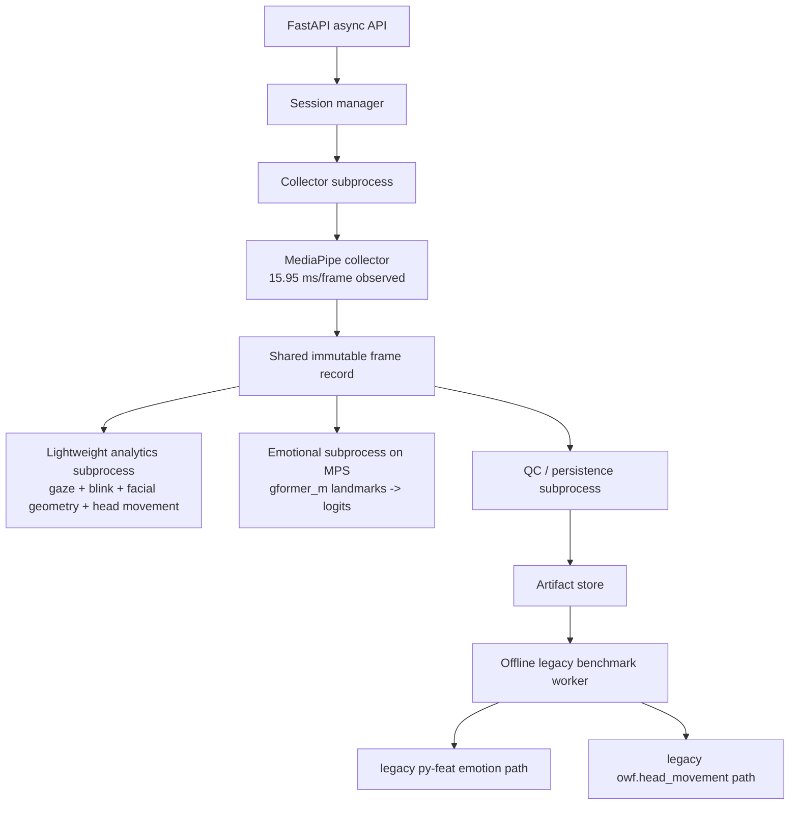

# Vision Concurrency Strategy for Alpha Backend

Reviewed on: 2026-06-01

## Summary

The alpha backend should use a strict **shared-extraction plus fan-out**
execution model with a **per-subprocess** `20 ms/frame` target.

Live processing should be split into these subprocesses:

1. A **collector subprocess** that runs one MediaPipe pass per frame and emits
   an authoritative shared frame record.
2. A **lightweight analytics subprocess** that consumes the shared record for
   gaze, blink, facial displacement, and current head movement.
3. An **emotional-expressivity subprocess** that consumes the shared landmarks
   and runs the fine-tuned `gformer_m` model on `mps`.

This is different from the earlier assumption that emotional expressivity and
head movement were still driven by the old `py-feat` paths. The current local
artifacts show:

- current production-style `head_movement` is no longer the `py-feat` path;
- current `emotional_expressivity` candidate is a fine-tuned landmark-only
  `gformer_m` model with `~15 ms` single-sample latency on `mps`.

The old `py-feat` emotion and head-pose paths should remain only as legacy
offline benchmarks or fallback research jobs.

## Measured Baseline

### Confirmed current local benchmarks

Relevant local sources:

- `head_movement/mediapipe_head_movement_pipeline_demo.ipynb`
- `head_pose_eval/mediapipe_head_pose_report.md`
- `head_movement/mediapipe_head_movement_parity_test.ipynb`
- `output/jupyter-notebook/emotional_expressivity/mediapipe_pyfeat_test.ipynb`
- `output/jupyter-notebook/emotional_expressivity/mediapipe_pyfeat_test/results/model_footprint_latency.csv`

Confirmed measurements in this workspace:

| Pipeline | Measured cost |
| --- | ---: |
| `MediapipeAnalyzer` over `video.mov` | `15.95 ms/frame` |
| `HeadMovement raw` post-processing from collected MediaPipe records | `0.056 ms/frame` |
| `HeadMovement relative_smoothed` post-processing from collected MediaPipe records | `0.080 ms/frame` |
| `mediapipe.shared_extract_only` | `14.93 ms/frame` |
| `mediapipe.matrix_raw` standalone parity path | `14.98 ms/frame` |
| `gformer_s` on `mps` (`precomputed landmarks -> logits`) | `12.616 ms` median |
| `gformer_m` on `mps` (`precomputed landmarks -> logits`) | `15.023 ms` median |
| `gformer_m` on `mps` (`precomputed landmarks -> logits`) | `19.197 ms` max over `50` runs |
| legacy `py-feat_default_stack` emotion path on `cpu` | `236.747 ms` median |
| legacy `owf.head_movement` parity baseline | `641.83 ms/frame` |

### What these numbers mean

- The current **MediaPipe collector budget is real** and already consumes most
  of one subprocess budget at `~15.95 ms/frame`.
- The current **head movement production candidate is no longer py-feat**.
  Once the shared MediaPipe record exists, current head-movement post-processing
  is effectively free at `0.056–0.080 ms/frame`.
- The current **fine-tuned emotional model is no longer the old py-feat stack**
  for the target live path. `gformer_m` on `mps` is inside the requested
  per-subprocess `20 ms` budget at `15.023 ms` median and `19.197 ms` max in
  the recorded benchmark.
- The legacy `py-feat` emotion and `owf.head_movement` paths are still far
  above the target and should not be used for live operational inference.
- Because `collector ~16 ms` and `gformer_m ~15 ms` are both significant,
  these stages must be **separate concurrent subprocesses** fed by the same
  shared frame record, not merged into one synchronous frame handler.

## Selected Execution Model

### Rule 1: one collector pass per frame

The live path must run one MediaPipe collector per source frame and share that
result across all lightweight analyzers.

The collector should own:

- face landmarks
- refined iris landmarks
- bbox derived from landmarks
- face transformation matrix
- optional blendshapes
- frame timestamps and frame status

The target collector is the notebook `MediapipeAnalyzer` shape, not multiple
independent per-feature wrappers around MediaPipe.

### Rule 2: separate live subprocesses are allowed only after shared extraction

Use separate live subprocesses for cost classes, but never duplicate MediaPipe
extraction.

Allowed live subprocess split:

- `collector`
- `lightweight analytics`
- `emotional gformer_m`

Forbidden split:

- one MediaPipe inference process for gaze;
- another MediaPipe inference process for blink;
- another MediaPipe inference process for head movement;
- another MediaPipe inference process for emotional expressivity.

Every downstream subprocess must consume the same immutable collector output
record keyed by `frame_index` and `timestamp_ms`.

### Rule 3: only legacy paths are isolated offline

The current offline-only paths are now narrowed to legacy baselines:

- legacy `py-feat_default_stack` emotional path;
- legacy `owf.head_movement` / `img2pose` parity path.

These remain useful for comparison, but not for live operational inference.

## Module Classification

| Module | Current implementation shape | Live per-frame allowed? | Alpha decision |
| --- | --- | --- | --- |
| `facial_landmarks_collector` | MediaPipe Face Landmarker / collector | Yes | Primary live collector subprocess |
| `gaze_estimation` | collector iris + landmarks + calibration | Yes | Lightweight live subprocess on shared record |
| `eye_blink_rate` | EAR is cheap; event summary is temporal | Yes | Lightweight live subprocess on shared record |
| `facial_expressivity` | landmark-derived geometry / displacement | Yes | Lightweight live subprocess on shared record |
| `head_movement` | current production candidate is `mediapipe_matrix` / `relative_smoothed` | Yes | Lightweight live subprocess on shared record |
| `emotional_expressivity` | fine-tuned `gformer_m` on normalized landmarks | Yes | Dedicated live `mps` subprocess on shared record |
| legacy `py-feat_default_stack` emotion path | image -> face/landmark/emotion stack | No | Offline benchmark / fallback only |
| legacy `owf.head_movement` parity path | `img2pose` / py-feat path | No | Offline benchmark / fallback only |

## Worker Architecture

## Runtime Budget

### Per-subprocess live budget

Hard alpha target:

- **each live subprocess path must remain under `20 ms/frame`**

This is a **subprocess SLA**, not a requirement that collector plus every
downstream model fit into one serial `20 ms` block.

Observed and planned budgets:

| Subprocess | Observed current cost | Budget |
| --- | ---: | ---: |
| Collector (`MediapipeAnalyzer`) | `15.95 ms/frame` | `<= 20 ms/frame` |
| Lightweight analytics on shared record | head movement `0.056–0.080 ms/frame`; other derived geometry should stay low | `<= 5 ms/frame` target, `<= 20 ms/frame` hard cap |
| Emotional `gformer_m` on `mps` | `15.023 ms` median, `19.197 ms` max | `<= 20 ms/frame` |

Operational implication:

- collector and emotional inference must run in parallel subprocesses;
- the shared frame record is the synchronization boundary;
- results may arrive asynchronously but must reference the same collector frame.

### Legacy offline budget

The remaining offline-only lane is now for legacy benchmark jobs:

- legacy `py-feat_default_stack`;
- legacy `owf.head_movement`.

## Queueing and Backpressure

### Collector queue

Use a session-scoped bounded collector queue:

- max `1` frame in processing;
- max `1` queued next frame;
- if a newer frame arrives while full, drop the oldest queued frame and keep
  the newest.

Reason:

- MediaPipe Tasks `VIDEO` mode requires monotonically increasing timestamps;
- collector is the authoritative clocked stage;
- collector already runs close to its own `20 ms` subprocess SLA.

Live frame payload:

- `session_id`
- `trace_id`
- `camera_frame_idx`
- `monotonic_ts_ms`
- `source_ts_ms`
- `frame_ref`
- `width`
- `height`
- `orientation`
- `requested_live_modules`
- `config_revision`

Collector output payload:

- `session_id`
- `camera_frame_idx`
- `timestamp_ms`
- `face_count`
- `face_detected`
- `landmarks_norm_xyz`
- `iris_landmarks`
- `bbox_xyxy_px`
- `bb_center_x`
- `bb_center_y`
- `face_scale_px`
- `transform_matrix_4x4`
- `blendshapes`
- `failure_reason`

### Analytics fan-out queues

From the collector output, fan out the same frame record into:

- a lightweight analytics queue;
- an emotional `gformer_m` queue.

Both queues should use:

- queue depth `1` or `2`;
- latest-wins policy;
- frame identity preserved by `session_id + frame_index + timestamp_ms`.

This preserves accuracy while allowing independent timing and failure handling.

### Legacy offline lane

Use a separate offline queue with:

- max `1` running legacy benchmark worker per host;
- max `1` queued legacy benchmark job per host.

Legacy job payload:

- `job_id`
- `session_id`
- `trace_id`
- `module_name`
- `input_video_path`
- `sampled_frame_refs`
- `landmark_artifact_path`
- `sampling_policy`
- `config`
- `retry_count`
- `deadline_ms`

## Timeouts and Failure Recovery

### Collector subprocess

- enqueue wait must stay under `5 ms`;
- collector `p95` must remain under `20 ms/frame`;
- if collector breaches `20 ms/frame` for `5` consecutive frames, reduce input
  frame rate or sampling before changing algorithmic behavior.

### Lightweight analytics subprocess

- target `<= 5 ms/frame`;
- hard cap `<= 20 ms/frame`;
- if breached, keep gaze and blink first, then shed optional geometry summaries.

### Emotional `gformer_m` subprocess

- benchmark target `p95 <= 20 ms/frame` on the same host while the collector is
  active;
- if MPS contention pushes emotional latency above budget, degrade in this
  order:
  1. latest-wins dropping for emotional outputs only;
  2. reduced emotional sampling rate;
  3. move emotion inference to nearline / post-session mode.

Session worker recovery:

- heartbeat every `1 s`
- if heartbeat is missing for `>3 s`, restart worker
- on restart, invalidate calibration and mark session as degraded

### Legacy offline lane

- kill the whole legacy worker process on timeout or native fault;
- retry once in a fresh process;
- if retry fails, mark job failed and do not affect live collector or live
  analytics workers.

## Accuracy and Separation Rules

### Accuracy rule

All live outputs for a frame must come from the **same collector record**. Do
not allow:

- one MediaPipe pass for gaze
- another for blink
- another for head movement
- another raw-image path for emotional expressivity

That would create timestamp drift, state mismatch, and unnecessary latency.

### Separation rule

Separation should happen at the **shared-record fan-out level**, not by
duplicating extraction:

- **collector subprocess**: one MediaPipe extraction pass;
- **lightweight analytics subprocess**: derived CPU-side features;
- **emotional subprocess**: `gformer_m` on `mps`;
- **legacy offline lane**: old py-feat benchmarks only.

This is the only separation model that is both accurate and compatible with the
current measured subprocess timings.

## Decision Table

| Option | Decision | Why |
| --- | --- | --- |
| Run CV directly in FastAPI request handlers | Reject | Breaks API responsiveness |
| Separate MediaPipe extraction subprocess per live feature | Reject | Duplicates extraction and breaks alignment |
| One collector subprocess feeding specialized live analytics subprocesses | Select | Accurate and compatible with current timings |
| Current production head movement on shared collector records | Select | `0.056-0.080 ms/frame` post-processing |
| `gformer_m` emotional inference on `mps` from shared landmarks | Select | `15.023 ms` median, `19.197 ms` max in recorded benchmark |
| legacy `owf.head_movement` live | Reject | `641.83 ms/frame` |
| legacy `py-feat_default_stack` live | Reject | `236.747 ms` median |
| legacy py-feat paths offline benchmark only | Select | Useful as comparison, not operational inference |

## Acceptance Criteria

The alpha strategy is acceptable only if all of these are true:

1. One MediaPipe collector pass serves all live frame features.
2. Collector `p95 <= 20 ms/frame` on the target host.
3. Emotional `gformer_m` worker `p95 <= 20 ms/frame` on the same host while the
   collector is also active.
4. Head movement live path uses collector transformation matrices / shared
   extract, not the legacy py-feat path.
5. Every worker output is keyed to the same collector `frame_index` and
   `timestamp_ms`.
6. Live queue policy preserves collector timestamp ordering and uses latest-wins
   dropping only downstream where needed.
7. API request handlers remain orchestration-only and do not own model calls.
8. Legacy benchmark worker failure cannot corrupt or stall live collector,
   lightweight analytics, or emotional workers.

## Immediate Implementation Direction

1. Move the notebook `MediapipeAnalyzer` shape into package code as the primary
   live collector.
2. Refactor gaze, EAR, facial displacement, and current head movement to
   consume the collector record.
3. Run fine-tuned `gformer_m` in its own live `mps` subprocess from shared
   normalized landmarks.
4. Keep legacy `py-feat_default_stack` and legacy `owf.head_movement` only as
   offline comparison or fallback benchmarks.
5. Add per-subprocess timers and concurrent-host benchmarks so the backend can
   prove each live subprocess remains under its `20 ms/frame` SLA.
